# Geothermische Untergrund-Wärmespeicher

Praktische Einführung in die Modellierung saisonaler Untergrund-Wärme­speicher
mit **OpenGeoSys 6**. Zwei Systemtypen, jeweils in 2D und 3D:

| System / Übung           | Geometrie                                            | Laufzeit (Default) |
|--------------------------|------------------------------------------------------|--------------------|
| `btes/ex1_2d`            | BTES — radialsymmetrische Einzelsonde (2D, r-z)      | ~30 s              |
| `btes/ex2_3d`            | BTES — Sondenfeld 3×3 in 3D                          | ~10–30 min         |
| `ates/ex1_2d`            | ATES — radialsymmetrischer Single-Well (2D, r-z)     | ~1 min             |
| `ates/ex2_3d`            | ATES — Single-Well in 3D                             | ~15–60 min         |

---

## Inhaltsverzeichnis

1. Motivation
2. Physikalische Grundlagen
3. Konzepte: BTES und ATES
4. Numerisches Modell
5. Installation
6. BTES — Übungen
7. ATES — Übungen
8. Interpretation der Plots
9. Fehlersuche
10. Literatur

---

## 1. Motivation

Wärme­angebot (Solarthermie, Industrie­abwärme) und Heiz­bedarf
fallen zeitlich auseinander — Überschuss im Sommer, Defizit im
Winter. Klassische **Puffer­speicher** (oberirdische Wasser­tanks, in denen
Wärme thermisch in einem geschlossenen Volumen gespeichert wird) sind
teuer und volumen­begrenzt. Der Untergrund selbst kann die
Speicher­aufgabe übernehmen — mit prinzipiell unbegrenztem Volumen
und niedrigen spezifischen Kosten.

Zwei Konzepte dominieren:

- **BTES — Borehole Thermal Energy Storage** (*Erdwärmesonden­speicher*):
  Wärme­träger­fluid zirkuliert in vertikalen Sonden, übergibt Wärme
  über die Sondenwand leitungs­gebunden ins Festgestein.
  **Geschlossener Kreislauf** (closed loop), getrennt vom Grundwasser.
- **ATES — Aquifer Thermal Energy Storage** (*Aquifer­speicher*):
  Wasser eines permeablen Aquifers wird als Speicher­medium genutzt.
  Heißes oder kaltes Wasser wird über Brunnen ein- und ausgespeist.
  **Offener Kreislauf** (open loop).

Beide nutzen denselben saisonalen Zyklus: charge (Sommer) →
storage → discharge (Winter) → storage. Über mehrere Jahre stellt
sich ein quasi-stationärer Betrieb ein.

---

## 2. Physikalische Grundlagen

### 2.1 Gekoppelter Strömungs- und Wärmetransport

In einem porösen Medium gelten zwei Erhaltungs­gleichungen.

**Massenbilanz­gleichung (Kontinuitäts­gleichung, Druck­form):**

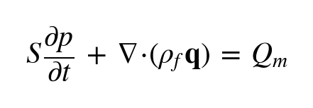

mit *p* = Porendruck [Pa], *S* = Speicher­koeffizient [1/Pa],
*ρf* = Fluid­dichte [kg/m<sup>3</sup>], *q* = Filter­geschwindigkeit
(Darcy-Geschwindigkeit) [m/s], *Q<sub>m</sub>* = volumetrischer
Massen­quellterm [kg/(m<sup>3</sup>·s)].

**Darcy-Gesetz:**

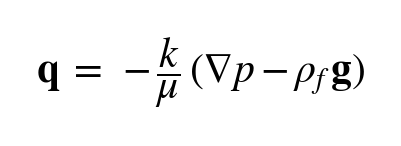

mit *k* = Permeabilität [m<sup>2</sup>], *μ* = Viskosität [Pa·s],
*g* = Schwerkraft.

**Wärmetransport­gleichung:**

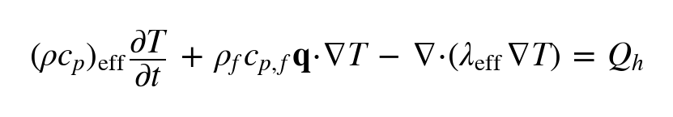

mit *T* = Temperatur [K], (ρc<sub>p</sub>)<sub>eff</sub> = effektive volumetrische
Wärme­kapazität, λ<sub>eff</sub> = effektive Wärme­leitfähigkeit, *Q<sub>h</sub>* =
Wärmequell­term [W/m<sup>3</sup>]. Der Advektions­term ist nur
wirksam, wenn Wasser strömt — bei BTES vernachlässigbar, bei ATES
dominierend.

OpenGeoSys nennt diesen gekoppelten Prozess **HT** (Hydro-Thermal).

### 2.2 Effektive Materialparameter

Volumen­gewichtete Mischung aus Fluid- und Festkörper­anteilen:

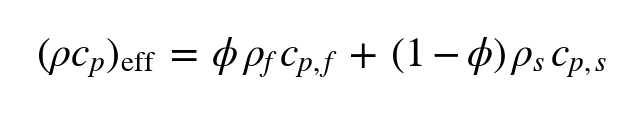

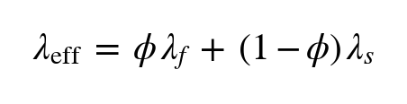

mit *φ* = Porosität, Index *f* = Wasser, Index *s* = Korngerüst.

### 2.3 Péclet-Zahl: Verhältnis Advektion zu Wärme­leitung

Die **Péclet-Zahl** ist die dimensions­lose Kennzahl, die das
Verhältnis von advektivem Wärme­transport (mit der Strömung) zu
leitungs­gebundenem Wärme­transport beschreibt. Sie entscheidet,
welcher Mechanismus den Energie­transport im porösen Medium
dominiert:

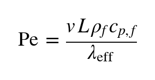

- **Pe « 1**: Wärme­leitung dominiert → **BTES-Regime**.
- **Pe » 1**: Advektion dominiert → **ATES-Regime**.


Bei BTES ist die Permeabilität des Festgesteins typisch
*k* ≈ 10<sup>-18</sup> m<sup>2</sup>, d. h. *q* ≈ 0 m/s und Pe → 0.
Praktisch reduziert sich das BTES-Problem auf reine transiente
Wärme­leitung. Bei ATES ist *k* ≈ 10<sup>-12</sup> m<sup>2</sup> →
messbare Filter­geschwindigkeit |q| ≈ 10<sup>-7</sup>–10<sup>-6</sup> m/s; advektives Plume folgt der Strömung.

### 2.4 Thermische Dispersion

In porösen Medien zerstreut die mikroskopische Geschwindigkeits­varianz
zwischen Poren die thermische Front zusätzlich zur reinen Leitung.
Modelliert durch einen Dispersions­tensor mit Längs- und
Quer­dispersivität (`dispersion.alpha_L_m`, `alpha_T_m`).

---

## 3. Konzepte: BTES und ATES

### 3.1 BTES — Sonden als volumetrische Quellen

In den Übungen wird das U-Rohr nicht im Detail aufgelöst. Stattdessen
wird jede Sonde durch ein kleines Volumen approximiert, in dem ein
volumetrischer Wärme­quell­term wirkt:

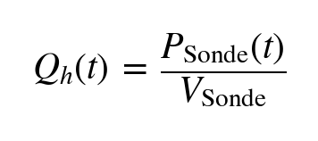

mit *P<sub>Sonde</sub>* der pro Sonde eingespeisten Leistung [W]. *P<sub>Sonde</sub>(t)*
schaltet zyklus­synchron: +P<sub>nenn</sub> (Lade), 0 (Storage), −P<sub>nenn</sub>
(Förder), 0 (Storage). Die Schaltkante wird durch eine **Rampe**
(`ramp_days`) geglättet.

**Mehrschicht-Boden­modell.** Der Untergrund wird durch eine Liste
von Bodenschichten beschrieben (Konfig­blockt `layers`, Reihenfolge
**von oben nach unten** wie in der Natur). Jede Schicht hat eigene
Werte für Schichtdicke, Permeabilität, Porosität, Dichte,
Wärme­kapazität und Wärme­leitfähigkeit. Die Sonde wird unabhängig
davon über `borehole.depth_top_m` und `borehole.depth_bottom_m`
positioniert (Tiefe **gemessen von der Oberfläche nach unten**) und
kann mehrere Schichten durchstoßen.

```python
CONFIG["layers"] = [
    {"name": "cover",    "thickness_m":  5.0,
     "permeability_m2": 1.0e-15, "porosity": 0.35,
     "rho_s_kg_m3": 1900, "cp_s_J_kgK": 1500, "lambda_s_W_mK": 1.4},
    {"name": "bedrock",  "thickness_m": 80.0,
     "permeability_m2": 1.0e-18, "porosity": 0.20,
     "rho_s_kg_m3": 2700, "cp_s_J_kgK":  900, "lambda_s_W_mK": 2.5},
    {"name": "basement", "thickness_m": 30.0,
     "permeability_m2": 1.0e-19, "porosity": 0.10,
     "rho_s_kg_m3": 2750, "cp_s_J_kgK":  850, "lambda_s_W_mK": 3.0},
]
CONFIG["borehole"] = {
    "r_borehole_m":   0.5,
    "depth_top_m":    7.0,    # Sondenkopf, von Oberfläche [m]
    "depth_bottom_m": 83.0,    # Sondenfuß, von Oberfläche [m]
}
```

Mesh-Generierung und PRJ-Erzeugung passen sich automatisch an: jede
Schicht bekommt ihre eigene MaterialID, die Sonde liegt als
zusätzliches Volumen mit eigenem Wärmequell­term darüber.

### 3.2 ATES — Brunnen als Quell-/Senke-Term

Der Aquifer ist eine permeable Schicht
(typisch *k* ≈ 10<sup>-12</sup> m<sup>2</sup>), nach oben und unten
durch dichtes **Cap Rock** begrenzt (*k* ≈ 10<sup>-18</sup>
m<sup>2</sup>). Wärme entweicht aus dem Aquifer fast nur
leitungs­gebunden.

In den Übungen wird der Brunnen vereinfacht modelliert:

- **Druckgleichung**: volumetrischer Massen­quell­term ±Q<sub>m</sub>/V<sub>screen</sub>
  im Filtervolumen.
- **Temperaturgleichung**: Dirichlet-Randbedingung auf der
  Filter-Subdomäne. Während Injektion = T<sub>inj</sub>; sonst ≈ T<sub>0</sub>.

Diese Vereinfachung (Dirichlet-Randbedingung der Temperatur am
Brunnen­filter) ist numerisch stabil, aber idealisiert. In der
Förder­phase pinnt sie die Brunnen­temperatur künstlich. Eine
physikalisch korrektere Alternative ist eine **Neumann-Randbedingung
2. Art** (vorgegebener Wärme­strom q<sub>n</sub> = m_dot · c<sub>p,f</sub> · ΔT
auf der Filter-Innen­fläche). Diese erfordert in OGS HT zusätzliche
Stabilisierung (SUPG); für die hier vorgesehene Auslegungs­studie
ist die Dirichlet-Variante ausreichend.

**Single-Well-Modus.** Alle ATES-Übungen verwenden einen **einzigen
aktiven Brunnen** — keinen Doublet. Der Brunnen injiziert in der
Lade­phase und fördert in der Förder­phase aus derselben Filterstrecke.
Damit das injizierte Wasser entweichen kann, wird der Lateral­rand
des Aquifers als Druck-Outlet gesetzt. Im **„ruhenden Aquifer"-Modus**
(Default) ist dort *p* = 0 — kein regionaler Grundwasser­fluss. Über
`regional_gw.enable = True` (ATES 3D) lässt sich auf der
Lateral­fläche ein **linearer Druckgradient** statt konstantem *p* = 0
aufprägen — siehe Konfigurations­parameter in Abschnitt 7.3.

### 3.3 Filterstrecke (ATES)

Der Brunnen ist nur in einem Höhen­abschnitt des Aquifers offen
(Filterstrecke), als Box mit `screen_top_offset_m` von oben und
`screen_bottom_offset_m` von unten definiert; die Filter­permeabilität
(`screen_permeability_m2`, typ. 10<sup>-9</sup> m<sup>2</sup>) ist
deutlich höher als die des Aquifers — Modell für den ausgekiesten
Brunnen­ausbau.

### 3.4 Randbedingungen — Übersicht

| System | Oberkante / Unterkante           | Lateralrand                                |
|--------|----------------------------------|--------------------------------------------|
| BTES   | Dirichlet *T*=*T*<sub>0</sub>, *p*=*p*<sub>0</sub> | kein Fluss (Symmetrie)              |
| ATES   | Dirichlet *T*=*T*<sub>0</sub>, *p*=*p*<sub>0</sub> | Aquifer-Außenseite: Dirichlet *p*=0 (Outlet) |

### 3.5 Zwei Modi für den Zyklus

Die folgenden zwei Modi sind im Übungs-Setup vorgesehen. Prinzipiell
lässt sich die zeitliche Steuerung der Quell-/Senke-Terme in OGS noch
deutlich feiner aufschlüsseln (z. B. tages­genaue Profile, gekoppelte
Last- und Außen­temperatur­modelle). Die hier angebotenen Modi sind
didaktisch motiviert und decken die wichtigsten saisonalen Effekte ab.

**Modus A — 4-Phasen-Zyklus (Default).** Pro Zyklus vier Phasen mit
fester Dauer (charge, storage, discharge, storage). Konstante
Lade-/Förder­leistung (BTES) oder konstanter Massenstrom +
Vorlauf­temperatur (ATES). Steuerung über `cycles.charge_days`,
`discharge_days`, `storage_after_*_days`, `n_cycles`.

**Modus B — Monatsprofil.** Liste von 12 monatlichen Speicher­leistungen
[W]. Positiv = laden, negativ = fördern, 0 = Stillstand. Jeder Monat
dauert 365.25/12 ≈ 30.44 d, die Sequenz wird `n_cycles`-mal wiederholt
(Anzahl Betriebs­jahre). Aktiviert durch
`cycles.monthly_power_W = [P_Jan, …, P_Dez]`.

- **BTES**: monatliche Leistung *P* wird direkt als Wärmequell­term
  *Q<sub>h</sub> = P / V<sub>Sonde</sub>* aufgeprägt.
- **ATES**: aus *P* und der Vorlauf­temperatur *T<sub>inj</sub>* wird der
  Massenstrom berechnet:

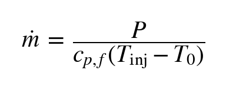

mit *c<sub>p,f</sub>* = spez. Wärme­kapazität Wasser
(`fluid.cp_J_kgK`), *T<sub>inj</sub>* = Vorlauf­temperatur,
*T<sub>0</sub>* = anfängliche Aquifer­temperatur (`initial.T_K`).
Vorlauf­temperatur per Default: `T_hot_K` bei *P* > 0, `T_cold_K`
bei *P* < 0; optional pro Monat über `cycles.monthly_T_inj_K`.

### 3.7 Reservoirtiefe und geothermischer Gradient

**Reservoirtiefe.** Die Lage des nutzbaren Speicher­bereichs ergibt
sich aus der Schichtung:

- **BTES**: Der Speicher­bereich um die Sonde wird durch
  `borehole.depth_top_m` (Sondenkopf, Tiefe unter Oberfläche) und
  `borehole.depth_bottom_m` (Sondenfuß) festgelegt; die Sonde kann
  mehrere Schichten aus `layers` durchstoßen.
- **ATES**: Die Tiefe des Aquifer­dachs unter Oberfläche ist
  `layers.caprock_top_thickness_m`; die Aquifer­dicke gibt
  `layers.aquifer_thickness_m` vor. Beide Werte sind direkt
  konfigurierbar — der Brunnen­filter sitzt innerhalb des Aquifers.

**Geothermischer Gradient.** Statt einer konstanten
Anfangs­temperatur kann ein **tiefen­abhängiges** *T*<sub>0</sub>(*z*)
gesetzt werden:

  *T*<sub>0</sub>(*z*) = *T*<sub>surface</sub> + grad · Tiefe(*z*)

Aktivierung über das CONFIG-Block `initial`:

```python
CONFIG["initial"]["T_surface_K"]                = 283.15   # 10 °C an der Oberfläche
CONFIG["initial"]["geothermal_gradient_K_per_m"] = 0.03    # typischer Wert ~ 3 K/100 m
```

Bei Gradient = 0 (Default) wird der konstante Wert `initial.T_K`
verwendet. Bei Gradient ≠ 0 erzeugen die Skripte intern eine
`Function`-Parameter-Definition für *T*<sub>0</sub>, die in OGS als
Anfangs­bedingung und in den Randbedingungen am oberen / unteren
Modell­rand wirkt.


Pädagogische Konsequenz: bei Mehrjahres­läufen mit Gradient ist
der „Hintergrund" am Sonden­fuß bereits wärmer als an der Erd­oberfläche
— die Recovery-Effizienz hängt damit zusätzlich von der Sondentiefe
ab.

---

## 4. Numerisches Modell

### 4.1 Diskretisierung

- **Finite-Elemente-Methode** (FEM) auf unstrukturierten Meshes.
- Netzgenerator: **gmsh**. Die Mesh-Strategie folgt einem drei­stufigen
  Verfeinerungs­schema:
  - **fein** innerhalb der Sonde / des Brunnen­filters
    (`mesh.size_in_borehole_m` bzw. `size_in_well_m`)
  - **mittel** im Nahbereich bis zu einem Übergangs­radius
    (`size_near_*`)
  - **grob** im Fernfeld (`size_far_m`) — dient nur als thermischer
    Puffer; die Wärme­front erreicht diese Zone in typischen
    Laufzeiten kaum.

  Geometrisch wird die Verfeinerung in gmsh über ein
  **Distance + Threshold**-Field realisiert.
- Konvertierung gmsh → OGS-VTU über `ogstools.Meshes.from_gmsh`.

### 4.2 Zeitintegration

- Implizites Euler-Schema, fester Zeitschritt `time.dt_seconds`
  (Default je nach Übung 1–14 Tage). Kleinere Schritte → genauer,
  aber teurer.

### 4.3 Linearer Löser

- Default: **BiCGSTAB + ILUT-Vorkonditionierer** mit Skalierung —
  iterativer Löser, geeignet für die typischen Mesh­größen der Übungen.
- Toleranzen über `solver.linear_tol` und `solver.linear_iter`
  einstellbar.

### 4.4 Typische numerische Fallen

| Symptom                              | Ursache                            | Abhilfe                                              |
|--------------------------------------|------------------------------------|------------------------------------------------------|
| T-Spitzen über Injektions­wert       | Advektives Overshoot (Pe » 1, ATES) | `dispersion.alpha_L_m` ↑ (5–10 m)                    |
| Negative T-Werte am Plume-Rand       | Mesh zu grob am Front-Knick         | Mesh feiner, Dispersivität ↑                         |
| „Singular matrix"                    | Zeitschritt zu groß / Ramp zu kurz  | `dt_seconds` halbieren, `ramp_days` ↑                |
| Druck­schwingungen am Brunnen        | Quell­term zu konzentriert (ATES)   | `screen_dx_m/dy_m` ↑ oder `screen_permeability_m2` ↑ |
| Konvergenz extrem langsam            | Mesh zu fein für ILUT-Pre           | `size_far_m` vergrößern                              |

---

## 5. Installation

Voraussetzungen: **Python 3.10–3.12**, Windows/Linux/macOS.

Jeder System-Ordner hat eine eigene `requirements.txt` (gleicher Inhalt):

```
python -m pip install --upgrade pip
python -m pip install -r requirements.txt
```

Pakete:

| Paket        | Zweck                                                |
|--------------|------------------------------------------------------|
| `ogs`        | OpenGeoSys 6 Python-Wheel (bringt `ogs.exe` mit)     |
| `ogstools`   | Mesh-Konvertierung gmsh → vtu                        |
| `gmsh`       | Netzgenerator                                        |
| `meshio`     | Mesh-I/O                                             |
| `numpy`      | Numerik                                              |
| `pyvista`    | Ergebnis-Auswertung                                  |
| `matplotlib` | Plots                                                |

### Windows-Hinweis (Microsoft-Store-Python)

Falls beim Import `FileNotFoundError: …\Python311\bin` erscheint,
einmalig eine Junction anlegen (PowerShell):

```
$lib = "$env:LOCALAPPDATA\Packages\PythonSoftwareFoundation.Python.3.11_qbz5n2kfra8p0\LocalCache\local-packages\Python311"
New-Item -ItemType Junction -Path "$lib\bin" -Target "$lib\site-packages\bin"
```

`ogs.exe` muss im `PATH` auffindbar sein. Der pip-Install legt es in
`%LOCALAPPDATA%\…\Python311\Scripts` ab — dieses Verzeichnis ggf. dem
`PATH` hinzufügen.

---

## 6. BTES — Übungen

### 6.1 BTES 2D radialsymmetrisch (Übung 1)

Eine einzelne vertikale Sonde auf der Symmetrie-Achse *r* = 0.
Das 3D-Problem wird durch Annahme rotations­symmetrischer Lösung auf
2D in der (*r*, *z*)-Halbebene reduziert. Vorteil: 100–1000× weniger
Zellen als 3D, Laufzeit in Sekunden.


**Ausführen:**

```
cd btes/ex1_2d
python btes_radial_2d.py     # Mesh + Simulation
python plot_results.py       # Plots → figures/
```

### 6.2 BTES 3D Sondenfeld (Übung 2)

Quaderförmiges Boden­volumen mit einem **3×3-Sondenfeld**
(Default-Abstand 5 m). Jede Sonde als kleines Volumen mit
volumetrischem Wärmequell­term. Volles 3D, ~50.000–150.000 Zellen.


**Ausführen:**

```
cd btes/ex2_3d
python btes_3d.py            # 10–30 min
python plot_results.py
```

Tipp: vorab Setup prüfen mit `python btes_3d.py --no-run`.

### 6.3 BTES — Einstellbare Parameter

Alle Stellschrauben liegen im `CONFIG`-Block oben im jeweiligen
Simulations-Skript.

**Material (Boden)**

| Parameter (voll qualifiziert)            | Bedeutung                                |
|------------------------------------------|------------------------------------------|
| `materials.soil.lambda_s_W_mK`           | Wärme­leitfähigkeit des Festgesteins     |
| `materials.soil.cp_s_J_kgK`              | spez. Wärme­kapazität                    |
| `materials.soil.rho_s_kg_m3`             | Dichte des Korngerüsts                   |
| `materials.soil.porosity`                | Porosität                                |

**Betrieb**

| Parameter (voll qualifiziert)            | Bedeutung                                |
|------------------------------------------|------------------------------------------|
| `operation.power_per_borehole_W`         | Heiz/Kühl-Leistung pro Sonde [W]         |

**Zyklen — Modus A (Default)**

| Parameter (voll qualifiziert)            | Bedeutung                                |
|------------------------------------------|------------------------------------------|
| `cycles.n_cycles`                        | Anzahl Wiederholungen des Zyklus         |
| `cycles.charge_days`                     | Lade-Phasendauer [d]                     |
| `cycles.discharge_days`                  | Förder-Phasendauer [d]                   |
| `cycles.storage_after_charge_days`       | Pause nach Beladung [d]                  |
| `cycles.storage_after_discharge_days`    | Pause nach Förderung [d]                 |
| `cycles.ramp_days`                       | Übergangsrampe (Stabilität) [d]          |
| `cycles.monthly_power_W`                 | `None` → Modus A aktiv                   |

**Zyklen — Modus B (Monatsprofil)**

```python
CONFIG["cycles"]["monthly_power_W"] = [+2000, +2000, +1500, +500, 0, 0,
                                         0, 0, -1500, -2500, -3000, -2500]
```

| Parameter (voll qualifiziert)            | Bedeutung                                |
|------------------------------------------|------------------------------------------|
| `cycles.monthly_power_W`                 | Liste 12 Werte [W]; `None` → Modus A     |
| `cycles.n_cycles`                        | Anzahl Betriebs­jahre                     |
| `operation.power_per_borehole_W`         | Referenz­leistung (Skalierung)            |

**Geometrie 2D**

| Parameter (voll qualifiziert)            | Bedeutung                                |
|------------------------------------------|------------------------------------------|
| `borehole.r_borehole_m`                  | Sondenradius                             |
| `borehole.top_offset_m`                  | Filterstrecke oben [m]                   |
| `borehole.bottom_offset_m`               | Filterstrecke unten [m]                  |
| `layers.borehole_zone_thickness_m`       | Sondentiefe [m]                          |
| `domain.r_max_m`                         | Modell­radius (lateral) [m]              |

**Geometrie 3D (zusätzlich)**

| Parameter (voll qualifiziert)            | Bedeutung                                  |
|------------------------------------------|--------------------------------------------|
| `field.n_x`, `field.n_y`                 | Sondenraster (x × y)                       |
| `field.spacing_m`                        | Sondenabstand [m]                          |
| `field.positions`                        | Optional explizite Liste `[(x,y), …]`      |
| `field.borehole_dx_m`, `borehole_dy_m`   | Sondenvolumen (x, y)-Ausdehnung [m]        |
| `mesh.size_in_borehole_m`                | Elementgröße im Sondenvolumen [m]          |
| `mesh.size_near_field_m`                 | Elementgröße im Feld-Nahbereich [m]        |
| `mesh.size_far_m`                        | Elementgröße im Fernfeld [m]               |

### 6.4 BTES — Aufgaben

Vorgehen pro Aufgabe: Parameter ändern, Simulation neu starten,
Plot-Skript ausführen, **Ziel­größen** aus den vier Plots ablesen und
gegenüberstellen.

| Ziel­größe                                | Quelle                       |
|-------------------------------------------|------------------------------|
| max. T am Sondenrand T<sub>max</sub>       | Plot 1                       |
| max. gespeicherte Energie E<sub>max</sub> [GJ] | Plot 3 (Konsolen­ausgabe)    |
| Recovery-Effizienz η [%]                   | Plot 3 (Konsolen­ausgabe)    |
| max. Reichweite r(ΔT>1 K) [m]              | Plot 4 (Konsolen­ausgabe)    |
| Plume-Form / Eindringtiefe                 | Plot 2                       |

**Aufgabe B1 — Wärme­leitfähigkeit des Festgesteins (2D)**
Setze `materials.soil.lambda_s_W_mK` auf 1.5, 2.5, 4.0 W/(m·K)
(typische Spannweite Lockergestein → Festgestein). Optional zusätzlich
0.8 und 5.0 W/(m·K) für die Extreme (Sand trocken / Quarzit). Trage
T<sub>max</sub>, η und max. Reichweite in eine Tabelle ein und ordne
ein, welche Größen mit λ steigen bzw. fallen. **Erweiterung:**
dieselbe Studie für `materials.soil.cp_s_J_kgK` (750–2000 J/(kg·K))
und `rho_s_kg_m3` (1800–2900 kg/m³) wiederholen, um den Einfluss der
volumetrischen Wärme­kapazität (ρ·c<sub>p</sub>) zu isolieren.

**Aufgabe B2 — Heiz-/Förderleistung (2D)**
Setze `operation.power_per_borehole_W` auf 1000, 2000 und 5000 W.
Vergleiche T<sub>max</sub> und E<sub>max</sub>. Prüfe, ob
T<sub>max</sub> linear oder überproportional skaliert und beurteile,
ab welcher Leistung das Modell unrealistische T-Werte (z. B. > 80 °C
im Festgestein) liefert.

**Aufgabe B3 — Anzahl der Zyklen (2D)**
Setze `cycles.n_cycles` auf 1, 3 und 5. Lies in Plot 1 ab, wie sich
die Basis­temperatur am Sondenrand am Ende jedes Zyklus ändert.
Bestimme: nach welcher Zyklenzahl ist die Änderung von Zyklus zu
Zyklus < 0.5 K (Einschwing­kriterium)?

**Aufgabe B4 — Asymmetrischer Zyklus (2D)**
Setze `cycles.charge_days = 120`, `storage_after_charge_days = 60`,
`discharge_days = 120`, `storage_after_discharge_days = 60` und
vergleiche mit dem symmetrischen Default (alle 91.25 d). Vergleiche
η und max. Reichweite.

**Aufgabe B5 — Sondenlänge (2D)**
Setze `layers.borehole_zone_thickness_m` auf 40, 80, 120 m. Bestimme
E<sub>max</sub>/Länge [GJ/m] und prüfe, ob die volumetrische
Energie­dichte konstant bleibt.

**Aufgabe B6 — Monatsprofil (2D)**
Aktiviere Modus B (Beispiel siehe oben) mit `n_cycles = 3`. Lies aus
Plot 1 ab, ob sich die Sondentemperatur am Ende von Jahr 1, 2, 3
unterscheidet (Einschwingen).

**Aufgabe B-AsymZyklen — Recovery-Verluste durch Asymmetrie (2D)**

Im symmetrischen Default-Zyklus (91.25 / 91.25 / 91.25 / 91.25)
ist η ≈ 100 %, weil Lade- und Förder­phase exakt dieselbe Energie
bewegen. Erzeuge ein verlust­behaftetes Szenario:

```python
# Asymmetrie 2:1 — doppelt so lange laden wie fördern
CONFIG["cycles"]["charge_days"]                  = 120.0
CONFIG["cycles"]["storage_after_charge_days"]    = 30.0
CONFIG["cycles"]["discharge_days"]               = 60.0
CONFIG["cycles"]["storage_after_discharge_days"] = 30.0
```

Lies η ab und vergleiche mit dem symmetrischen Default. Erweitere
mit `n_cycles = 3` und dünnem Cover (`layers[0]["thickness_m"] = 1.0`),
um die Verluste nach oben zu verstärken; η fällt typisch unter 25 %.

> Pädagogische Lektion: η = 100 % im Default-Setup ist ein
> **Modell-Artefakt der symmetrischen Q<sub>h</sub>-Steuerung**,
> nicht ein physikalisches Resultat. Saisonale Asymmetrie zwischen
> Heiz­bedarf (Winter) und Lade­möglichkeit (Sommer) macht den
> Unterschied sichtbar.

**Aufgabe B-Solar — Solar-gekoppeltes Monatsprofil (2D)**

Verknüpfung der Solarthermie-Übung Geothermie 4 / Übung 2 mit der
Speicher­simulation: monatliche Solar­erträge werden über die Bilanz
mit dem Heiz­bedarf in eine Speicher­leistung *P*(*m*) umgesetzt.

1. Wähle eine Kollektor­fläche *A*<sub>koll</sub> (z. B. 25–40 m²) und einen
   Jahres­wärmebedarf *Q*<sub>jährlich</sub> (z. B. 20 000–30 000 kWh/a).
2. Erzeuge das Monats­profil mit `solar_to_monthly.py` (siehe
   Abschnitt 3.6) und setze das Ergebnis in `CONFIG["cycles"]["monthly_power_W"]`.
3. `cycles.n_cycles = 3` (drei Betriebs­jahre).

Lies pro Lauf ab:

| Eingabe                                              | Ablesen                                |
|------------------------------------------------------|----------------------------------------|
| *A*<sub>koll</sub> = *A*<sub>balanced</sub> (Σ ΔQ ≈ 0) | η, T<sub>max</sub>, max. Reichweite    |
| *A*<sub>koll</sub> = 1.3 · *A*<sub>balanced</sub>     | η, T<sub>max</sub>, Plume-Wachstum     |
| *A*<sub>koll</sub> = 0.7 · *A*<sub>balanced</sub>     | T<sub>min</sub> am Ende des dritten Winters |

Ordne ein: was passiert mit dem Boden­speicher bei
über-/unterdimensionierter Kollektor­fläche? Welche Variante ist
nachhaltig?

**Aufgabe B7 — Sonden­abstand (3D)**
Setze `field.spacing_m` auf 3, 5, 8 m. Vergleiche T<sub>max</sub> im
Zentrum und am Rand des Felds. Bestimme den Mindestabstand, ab dem
T<sub>max,Zentrum</sub> − T<sub>max,Außen</sub> < 2 K (Wechsel­wirkungs­schwelle).

**Aufgabe B8 — Feldgeometrie (3D)**
Wechsle von 3×3 (Default) auf 1×9 (Linien­feld; `field.n_x = 9`,
`field.n_y = 1`). Vergleiche bei sonst gleichen Parametern
E<sub>max</sub>, η und max. Reichweite.

**Aufgabe B9 — Mehrjahres­vorwärmung (3D)**
Setze `cycles.n_cycles = 3`. Lies aus Plot 1 die zentrale Sonden­temperatur
am Ende von Jahr 1, 2, 3 ab. Bestimme die „Vorwärmung"
T<sub>Ende,Jahr 3</sub> − T<sub>0</sub>.

**Aufgabe B10 — Leistungs­skalierung (3D)**
Setze `operation.power_per_borehole_W` auf 1000, 2000, 3000, 5000 W.
Bestimme den Wert, bei dem T<sub>max,Zentrum</sub> = 30 °C erreicht
wird (lineare Interpolation aus den drei Werten). Lies η für jeden
Lauf ab.

> **Grundwasser­einfluss bei BTES.** Die Bodenmatrix ist standardmäßig
> mit *k* ≈ 10<sup>-18</sup> m<sup>2</sup> quasi-impermeabel; eine
> regionale Grundwasser­strömung wirkt sich auf den Wärme­transport
> kaum aus (Pe « 1). Soll der Effekt dennoch untersucht werden,
> erlaubt das `materials.soil.permeability_m2` eine Variation hin zu
> klüftigem Untergrund (z. B. 10<sup>-14</sup> m<sup>2</sup>); in
> diesem Regime wird die Sonden­wechsel­wirkung mit Hintergrund-Flow
> sichtbar.

---

## 7. ATES — Übungen

> Alle ATES-Übungen sind als **Single-Well-Anlage** ausgelegt
> (ein aktiver Brunnen, der in der Lade­phase injiziert und in der
> Förder­phase aus derselben Filterstrecke entnimmt).

### 7.1 ATES 2D radialsymmetrisch (Übung 1)

Ein einzelner Brunnen auf der Symmetrie-Achse *r* = 0 in einem
Aquifer zwischen Cap-Rock-Schichten. Das 3D-Problem wird durch
Annahme rotations­symmetrischer Lösung auf 2D in der
(*r*, *z*)-Halbebene reduziert. Lateral­rand als Druck-Outlet
(Dirichlet *p* = 0).


**Ausführen:**

```
cd ates/ex1_2d
python ates_radial_2d.py     # ~1 min
python plot_results.py
```

### 7.2 ATES 3D Single-Well (Übung 2)

Volle dreidimensionale Modell­domäne (rechteckiges Volumen) mit aktivem Brunnen im Zentrum. Eine zweite
Brunnen­geometrie (CW) ist im Mesh enthalten, hydraulisch jedoch
deaktiviert — sie dient als passive Beobachtungs­position. Lateral­rand
des Aquifers als Druck-Outlet (Dirichlet *p* = 0). Typisch
50.000–200.000 Zellen.


**Ausführen:**

```
cd ates/ex2_3d
python ates_3d.py            # 15–60 min
python plot_results.py
```

Phänomene, die das 2D-Modell **nicht** zeigt:

- **Auftrieb** (Buoyancy): bei *β* > 0 und großem Δ*T* steigt die
  heiße Fahne; der Plume wird vertikal asymmetrisch.
- **Regionale Grundwasser­strömung**: verschiebt den Plume in
  Hauptströmungs­richtung (Default = 0).
- **3D-Plume-Geometrie**: nicht mehr exakt radial.

> **Doublet-Modus.** Auf Wunsch lässt sich ein klassischer
> **Doublet-Betrieb** (zwei Brunnen — Hot Well HW und Cold Well CW —
> die gegen­phasig fördern und injizieren) aktivieren durch
> `wells.single_well_mode = False`. Dann fördert die zweite Bohrung
> in der Lade­phase und injiziert in der Förder­phase.

### 7.3 ATES — Einstellbare Parameter

Alle Stellschrauben im `CONFIG`-Block des Simulations-Skripts.

**Material (Aquifer und Cap-Rock)**

| Parameter (voll qualifiziert)            | Bedeutung                                  |
|------------------------------------------|--------------------------------------------|
| `materials.aquifer.permeability_m2`      | Permeabilität des Aquifers                 |
| `materials.aquifer.porosity`             | Porosität                                  |
| `materials.aquifer.rho_s_kg_m3`          | Korngerüst-Dichte                          |
| `materials.aquifer.cp_s_J_kgK`           | spez. Wärme­kapazität (Korn)               |
| `materials.aquifer.lambda_s_W_mK`        | Wärme­leitfähigkeit (Korn)                 |
| `materials.caprock_top.*` (analog)       | Eigenschaften der Deckschicht              |
| `materials.caprock_bottom.*` (analog)    | Eigenschaften der Sohlschicht              |

**Betrieb**

| Parameter (voll qualifiziert)            | Bedeutung                                  |
|------------------------------------------|--------------------------------------------|
| `operation.mass_flow_rate_kg_s`          | Massenstrom je Brunnen [kg/s]              |
| `operation.T_hot_K`                      | Vorlauf­temperatur Lade-Phase [K]          |
| `operation.T_cold_K`                     | Vorlauf­temperatur Förder-Phase [K]        |

**Zyklen — Modus A (Default, identisch zu BTES)**

Wie BTES Modus A, plus die ATES-spezifischen Temperaturen oben.

**Zyklen — Modus B (Monatsprofil mit Speicher­leistung)**

```python
CONFIG["cycles"]["monthly_power_W"] = [+80_000, +60_000, +30_000, 0, 0, 0,
                                         0, 0, -30_000, -60_000, -90_000, -90_000]
```

| Parameter (voll qualifiziert)            | Bedeutung                                  |
|------------------------------------------|--------------------------------------------|
| `cycles.monthly_power_W`                 | Liste 12 Werte [W]; `None` → Modus A       |
| `cycles.monthly_T_inj_K`                 | Optional 12 Werte Vorlauf­temperatur [K]   |
| `cycles.n_cycles`                        | Anzahl Betriebs­jahre                       |
| `operation.mass_flow_rate_kg_s`          | Referenz-/Nenn-Massenstrom (Skalierung)     |

Pro Monat wird m_dot aus *P* und Vorlauf­temperatur über die in
Abschnitt 3.5 genannte Formel berechnet.

### 3.6 Kopplung Solarthermie–Speicher

Die Monats­leistungen *P*(*m*) ergeben sich realistisch aus der
Differenz zwischen monatlichem Solar­ertrag *q*<sub>sol</sub>(*m*) eines
Kollektorfelds und dem monatlichen Wärme­bedarf *Q*<sub>bed</sub>(*m*)
einer angeschlossenen Anlage:

  Δ*Q*(*m*) = *A*<sub>koll</sub> · *q*<sub>sol</sub>(*m*) − *Q*<sub>bed</sub>(*m*)   [kWh/Monat]
  *P*(*m*) = Δ*Q*(*m*) · 3.6·10<sup>6</sup> / (*d*(*m*) · 86400)   [W]

mit *d*(*m*) = Tage des Monats. Positives Δ*Q* (Sommer­überschuss) → laden,
negatives (Winter­defizit) → fördern.

**Auslegungs­kriterium.** Damit der Speicher nicht überdimensioniert
ist, sollte die Jahres­bilanz Σ<sub>m</sub> Δ*Q*(*m*) ≈ 0 sein
(*A*<sub>koll</sub> so wählen, dass *A*<sub>koll</sub> ·
Σ *q*<sub>sol</sub>(*m*) ≈ Σ *Q*<sub>bed</sub>(*m*)). Eine zu große
Fläche führt zu einem netto „aufladenden" Speicher (η → 0 in den
Plots), eine zu kleine zu einem netto „leerenden".

**Hilfsskript.** `solar_to_monthly.py` (auf Top-Level von `exercises/`)
liest die Tabelle `data/Solarthermie_Berechnungshilfe.xlsx` (sheets
`Vakuum-Röhrenkollektor`, `Flachkollektor`), nimmt
*A*<sub>koll</sub> und das Lastprofil entgegen und liefert die fertige
12-Werte-Liste `monthly_power_W`.

```python
from solar_to_monthly import monthly_power_W, demand_from_annual
demand = demand_from_annual(Q_annual_kWh=25_000)          # typisches Saisonprofil
P = monthly_power_W(A_koll_m2=30.0, demand_kWh_per_month=demand,
                    sheet="Vakuum-Röhrenkollektor", beta_deg=40)
CONFIG["cycles"]["monthly_power_W"] = P
```

Direkt­aufruf liefert eine Demo-Tabelle plus Hinweis auf die für
Σ Δ*Q* = 0 nötige Kollektor­fläche:

```
python solar_to_monthly.py
```


**Geometrie 2D**

| Parameter (voll qualifiziert)            | Bedeutung                                  |
|------------------------------------------|--------------------------------------------|
| `well.r_well_m`                          | Brunnenradius [m]                          |
| `well.screen_top_offset_m`               | Filterabstand zur Aquiferdecke [m]         |
| `well.screen_bottom_offset_m`            | Filterabstand zum Aquiferboden [m]         |
| `layers.aquifer_thickness_m`             | Aquiferdicke [m]                           |
| `layers.caprock_top_thickness_m`         | Mächtigkeit Deckschicht [m]                |
| `layers.caprock_bottom_thickness_m`      | Mächtigkeit Sohlschicht [m]                |
| `domain.r_max_m`                         | Modell­radius [m]                          |
| `dispersion.alpha_L_m`, `alpha_T_m`      | thermische Dispersivität                   |

**Geometrie 3D (zusätzlich)**

| Parameter (voll qualifiziert)            | Bedeutung                                  |
|------------------------------------------|--------------------------------------------|
| `wells.single_well_mode`                 | True = nur HW aktiv (Default), False = Doublet |
| `wells.hot_well_xy`                      | Lage des aktiven Brunnens als `(x, y)` [m] |
| `wells.cold_well_xy`                     | passive Position (Default Single-Well)     |
| `wells.screen_dx_m`, `screen_dy_m`       | Filtervolumen-Ausdehnung [m]               |
| `wells.screen_permeability_m2`           | Permeabilität im Filterkies                |
| `domain.size_x_m`, `domain.size_y_m`     | Lateral­ausdehnung [m]                     |
| `mesh.size_in_well_m`, `size_near_wells_m`, `size_far_m` | Mesh-Auflösungs­hierarchie  |
| `fluid.beta_1_per_K`                     | Therm. Ausdehnungs­koeffizient (Auftrieb)  |

**Regionale Grundwasser­strömung (optional)**

| Parameter (voll qualifiziert)            | Bedeutung                                  |
|------------------------------------------|--------------------------------------------|
| `regional_gw.enable`                     | True = linearer Druckgradient auf Lateral­rand (Hintergrund-Strömung), False = ruhender Aquifer (Default) |
| `regional_gw.gradient_m_per_m`           | hydraulischer Gradient (dimensions­los, z. B. 10<sup>-3</sup>) |
| `regional_gw.direction_deg`              | Strömungs­richtung in Grad (0° = +x, 90° = +y, …) |

Aktiviertes `regional_gw` verschiebt das Plume in Strömungs­richtung —
sichtbar in Plot 2 (Asymmetrie um den Brunnen) und Plot 4 (effektive
Reichweite stromabwärts deutlich größer als stromaufwärts).

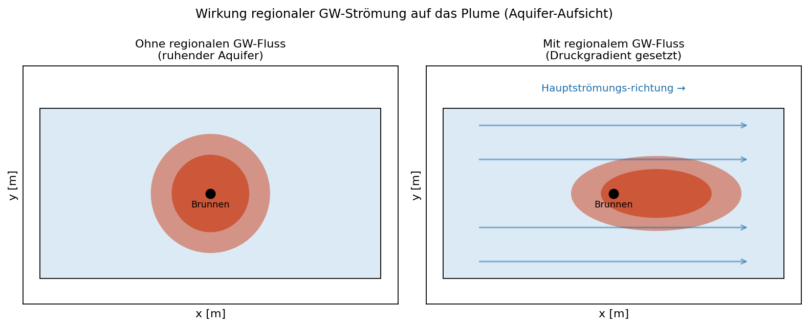

### 7.4 ATES — Aufgaben

Ziel­größen pro Lauf:

| Ziel­größe                                | Quelle                       |
|-------------------------------------------|------------------------------|
| max. T am Brunnenrand T<sub>max</sub>     | Plot 1                       |
| max. gespeicherte Energie E<sub>max</sub> [GJ] | Plot 3 (Konsole)             |
| Recovery-Effizienz η [%]                  | Plot 3 (Konsole)             |
| max. Reichweite r(ΔT>1 K) [m]             | Plot 4 (Konsole)             |
| Plume-Form (rund / vertikal verschoben)   | Plot 2                       |

**Aufgabe A1 — Aquifer-Permeabilität (2D)**
Setze `materials.aquifer.permeability_m2` auf 10<sup>-13</sup>,
10<sup>-12</sup>, 10<sup>-11</sup> m<sup>2</sup>. Trage max. Reichweite
und η in eine Tabelle ein und ordne ein, welche Größe stärker auf
*k* reagiert.

**Aufgabe A2 — Massenstrom (2D)**
Setze `operation.mass_flow_rate_kg_s` auf 0.5, 2.0 und 5.0 kg/s.
Vergleiche max. Reichweite, η und E<sub>max</sub>. Identifiziere den
Trade-off zwischen Speicher­kapazität und Recovery.

**Aufgabe A3 — Injektions­temperatur (2D)**
Setze `operation.T_hot_K` auf 333 K, 343 K, 353 K, 363 K (60–90 °C).
Vergleiche E<sub>max</sub> und η. Bestimme, bei welcher
*T*<sub>inj</sub> der Energie­ertrag pro Grad Δ*T* maximal ist
(E<sub>max</sub> / (*T*<sub>inj</sub> − *T*<sub>0</sub>)).

**Aufgabe A4 — Aquifer­dicke (2D)**
Setze `layers.aquifer_thickness_m` auf 20, 30, 50 m (Werte unter
15 m können bei Default-Filterstrecke zu Konvergenz­problemen
führen — dann `well.screen_top_offset_m` / `screen_bottom_offset_m`
reduzieren). Bestimme E<sub>max</sub>/Dicke [GJ/m] und vergleiche
die spezifische Energie­dichte. Vergleiche zusätzlich die vertikale
Ausdehnung des Plumes in Plot 2.

**Aufgabe A5 — Cap-Rock-Mächtigkeit (2D)**
Setze `layers.caprock_top_thickness_m` auf 30, 60, 120 m
(Halbierung, Default, Verdopplung). Vergleiche η; quantifiziere den
zusätzlichen Wärme­verlust nach oben über die Differenz Δη.

**Aufgabe A6 — Mehrjahres­betrieb (2D)**
Setze `cycles.n_cycles = 5`. Trage T<sub>max</sub> und η je Zyklus
aus Plot 1/3 ab. Bestimme die Zyklenzahl, ab der η von Jahr zu Jahr
um weniger als 2 Prozent­punkte wächst (Einschwing­kriterium).

**Aufgabe A7 — Monatsprofil mit Speicher­leistung (2D)**
Aktiviere Modus B (Beispiel siehe oben) mit `n_cycles = 2`. Trage
den maximalen Massenstrom ab (`operation.mass_flow_rate_kg_s` ist
Skalierungs­referenz). Vergleiche η und max. Reichweite mit dem
4-Phasen-Default.

**Aufgabe A-Solar — Solar-gekoppeltes Monatsprofil (2D)**

Brücke aus Solarthermie-Übung Geothermie 4 / Übung 2 in die Speicher­simulation.

1. Identische Eingaben wie Aufgabe B-Solar (gleiche *A*<sub>koll</sub>,
   gleicher Jahres­bedarf), `monthly_power_W` mit
   `solar_to_monthly.py` berechnen.
2. Vorlauf­temperatur konstant: `operation.T_hot_K = 333.15`
   (60 °C, typische Solarspeicher­temperatur).
   Optional: monatliche Vorlauf­temperatur per
   `cycles.monthly_T_inj_K` (Sommer höher, Übergangsmonate kühler).
3. `cycles.n_cycles = 3`.

Lies pro Lauf ab: η, E<sub>max</sub>, max. Reichweite und den
maximalen Massenstrom (Skalierungs­vielfaches von
`mass_flow_rate_kg_s`).

**Aufgabe A-vs-B — Direkt­vergleich ATES vs. BTES (2D)**

Identische Eingangs-`monthly_power_W` aus Aufgabe B-Solar / A-Solar
in beiden Systemen. Erstelle eine Tabelle:

Auszufüllen pro Lauf: System, η [%], max. Reichweite [m],
T<sub>max</sub> [°C] — Werte aus den Plot-Skript-Konsolen­ausgaben.

Ordne ein: welches System liefert bei identischer Anregung die
höhere Recovery-Effizienz? Welches die kompaktere Plume? Was sind
mögliche Gründe (advektiver vs. leitungs­gebundener Transport,
Cap-Rock-Verluste)?

**Aufgabe A8 — Aquiferdicke (3D)**
Setze `layers.aquifer_thickness_m` auf 20, 30, 50 m. Berechne
E<sub>max</sub>/Dicke [GJ/m] und vergleiche die spezifische
Energie­dichte. Lies η ab.

**Aufgabe A9 — Massenstrom (3D)**
Setze `operation.mass_flow_rate_kg_s` auf 0.5, 1.0, 2.0 kg/s. Lies
max. Reichweite und η ab. Trage Reichweite gegen m_dot auf und
ordne ein, ob der Zusammenhang linear oder unterproportional ist.

**Aufgabe A10 — Auftrieb (3D, Dichte­abhängigkeit)**
Setze `fluid.beta_1_per_K = 4.0e-4` (Wasser bei ~30 °C) und
vergleiche mit β = 0. Lies die vertikale Verschiebung des Plumes
aus Plot 2 ab (Höhen­unterschied der heißen Fahne von der
Aquifer-Mitte).

**Aufgabe A11 — Mehrjahres­betrieb (3D)**
Setze `cycles.n_cycles = 3`. Lies T<sub>max</sub> und η je Zyklus
aus Plot 1/3 ab. Bestimme, ob η über die Jahre steigt (Aquifer
„lädt sich auf") oder fällt (Verluste überwiegen).

**Aufgabe A-HochT — Hochtemperatur-Betrieb mit niedrigerer Recovery (2D)**

Im Default-Setup liegt η nahe 70 %, weil das Cap-Rock dick und die
Betriebs­temperatur moderat ist. Erzwinge ein verlustbehaftetes
Szenario mit höheren Temperaturen und einem dünnen Cap-Rock-Top:

```python
CONFIG["operation"]["T_hot_K"]              = 363.15   # 90 °C
CONFIG["operation"]["mass_flow_rate_kg_s"]  = 2.0
CONFIG["cycles"]["n_cycles"]                = 3
CONFIG["layers"]["caprock_top_thickness_m"] = 20.0
```

Vergleiche η, max. Reichweite und das T-Feld (Plot 2) mit dem
Default. Identifiziere, welcher der drei Faktoren (Δ*T*,
Cap-Rock-Dicke, Massenstrom × Zyklen) den größten Beitrag zur
Effizienz­minderung liefert, indem du jeweils nur einen Parameter
relativ zum Default-Setup änderst.

**Aufgabe A12 — Regionale Grundwasser­strömung (3D)**
Aktiviere `regional_gw.enable = True` und variiere
`gradient_m_per_m` ∈ {10<sup>-4</sup>, 10<sup>-3</sup>, 10<sup>-2</sup>}
bei `direction_deg = 0`. Vergleiche in Plot 2 die Asymmetrie des
Plumes (stromaufwärts vs. stromabwärts), lies η und max. Reichweite
ab. Identifiziere den Gradient, ab dem das Plume merklich in
Strömungs­richtung „weggetragen" wird und η einbricht.

---

## 8. Interpretation der Plots

Das Plot-Skript jeder Übung erzeugt fünf PNG-Bilder im Unter­verzeichnis
`figures/`. Die **Rohdaten** der Simulation liegen daneben im
`out/`-Verzeichnis (`*.vtu` pro Zeitschritt, `*.pvd` als
Zeit­serien-Sammeldatei). Diese lassen sich auch direkt in ParaView
öffnen, um eigene Visualisierungen zu erstellen.

### 8.1 `1_well_temperature.png` — T am Brunnen/Sonde

Tem­peratur­verlauf an einem Auswerte­punkt nahe der Sonde/des
Brunnens (BTES: Sondenrand; ATES: Brunnenrand in Aquifer-Mitte).
Wonach schauen:

- **Anstieg** während Lade­phase, **Plateau** bei konstanter
  Leistung/T<sub>inj</sub>.
- **Abfall** in der Pause (Wärme diffundiert weg).
- **Förder­phase**: bei BTES steile Abkühlung; bei ATES hält die
  Dirichlet-BC die Temperatur künstlich hoch (Modell­grenze).
- Über mehrere Zyklen: **Drift** der Basis­temperatur als Indikator,
  ob das System „aufgeladen" oder „erschöpft" wird.

### 8.2 `2_field_snapshots.png` — T-Feld-Schnitte

Vier Momentaufnahmen (Anfang, kurz nach Lade­ende, Mitte
Förder­phase, Ende).

- **BTES**: Plume annähernd **sphärisch** (Leitung dominiert), wächst
  mit *r* ∝ √(α·*t*).
- **ATES**: Plume annähernd **kreis-/zylinder­förmig** um den Brunnen
  (Advektion). Cap-Rock-Grenzen sichtbar als Knick im Plume.

### 8.3 `3_energy_balance.png` — Gespeicherte Wärmemenge ΔE(t)

Domänen-Integral:

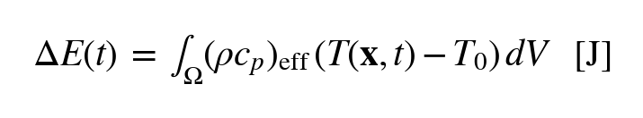

Skalen­wahl im Plot: GJ.

**Recovery-Effizienz:**

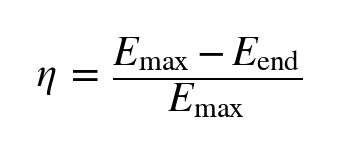


η ≈ 100 % bedeutet: alle gespeicherte Wärme wieder entnommen. Realer
BTES erreicht 30–80 %, ATES bei guter Auslegung 50–80 %.

**Plot-Skript-Konsolen­ausgabe.** Neben η werden ausgegeben:

- *Injektion pro Zyklus* = *P*·*t*<sub>charge</sub> (BTES) bzw.
  *m_dot* · *c*<sub>p,f</sub> · Δ*T* · *t*<sub>charge</sub> (ATES).
  Das ist die *theoretische* zugeführte Wärme­menge pro Lade­phase.
- *max. integrierte Energie E*<sub>max</sub>: über die gesamte Domain
  integriert (`(ρc<sub>p</sub>)<sub>eff</sub> · (T − T<sub>0</sub>) dV`).
  Bei ATES kann *E*<sub>max</sub> die Injektion deutlich übersteigen,
  weil die Dirichlet-T-Randbedingung am Brunnenfilter implizit
  zusätzliche Wärme zuführt, um *T*<sub>well</sub> = *T*<sub>inj</sub>
  zu halten. Ein Hinweis darauf wird mit­gedruckt.
- *Recovery η (geclampt)*: clamped auf [0, 100 %] für die Anzeige;
  der ungeclampte Rohwert wird ebenfalls ausgegeben. Werte > 100 %
  im Rohwert sind numerische Artefakte (Bilanz­integral knapp negativ
  am Zyklus­ende, z. B. durch Rand­leakage über die Dirichlet-T-BC
  an der Oberfläche).

> Die Dirichlet-T-Vereinfachung am Brunnen kann den Energie­abfluss
> in der Förder­phase verzerren. Trends (Reihenfolge mehrerer
> Parameter­variationen) bleiben aussagekräftig.

### 8.4 `4_plume_extent.png` — Reichweite ΔT > 1 K

Maximaler Radius der Knoten mit (*T* − *T*<sub>0</sub>) > 1 K
(Default-Schwelle, einstellbar im Plot-Skript).

- **BTES**: in der (*r*, *z*)-Halbebene (2D) oder horizontaler
  Abstand vom Feldzentrum (3D).
- **ATES**: nur Knoten im Aquifer berücksichtigt.

Wichtig für **Schutz­abstands­bemessung** zu Nachbar­anlagen oder
Trinkwasser­brunnen.

### 8.5 `5_power_schedule.png` — Schalt­profil über die Zeit

Zeigt die zeitliche Steuerung der Quell-/Senke-Terme — bei BTES die
Sondenleistung P(t) [kW] (positiv = laden, negativ = fördern), bei
ATES Massenstrom und Vorlauf­temperatur. Die Rampen (`cycles.ramp_days`)
sind als sanfter Übergang zwischen den Phasen sichtbar. Im Modus B
(Monatsprofil) wird das tatsächlich eingestellte Saisonprofil
visualisiert.

---

## 9. Fehlersuche

| Symptom                                  | Ursache / Fix                                                    |
|------------------------------------------|------------------------------------------------------------------|
| `ogs.exe nicht im PATH`                  | Scripts-Verzeichnis dem `PATH` hinzufügen (s. Installation)      |
| `FileNotFoundError: …\Python311\bin`     | Junction anlegen (s. Windows-Hinweis)                            |
| `ImportError: msh2vtu`                   | `pip install --upgrade ogstools`                                 |
| OGS bricht ab mit „singular matrix"      | `dt_seconds` halbieren, `ramp_days` ↑                            |
| Unphysikalische T-Spitzen / Negativwerte | (ATES) `dispersion.alpha_L_m` ↑ (5–10 m), Mesh feiner            |
| Druck­schwingungen am Brunnen (ATES)     | `screen_dx_m/dy_m` ↑ oder `screen_permeability_m2` ↑             |
| Sehr lange Laufzeit (>1 h)               | `n_cycles` reduzieren oder Domäne verkleinern                    |

---

## 10. Literatur

- O. Kolditz et al.: *Thermo-Hydro-Mechanical-Chemical Processes in
  Fractured Porous Media*. Springer.
- M. Reuß: *Erdwärmesonden­anlagen und unterirdische Wärmespeicher*.
- W. K. Bauer et al.: *Aquifer Thermal Energy Storage — A Review*.
  Renewable & Sustainable Energy Reviews, 2010.
- OpenGeoSys-Dokumentation: <https://www.opengeosys.org/docs/>
- OGS HT-Benchmarks:
  <https://www.opengeosys.org/docs/benchmarks/heat-transport/>
