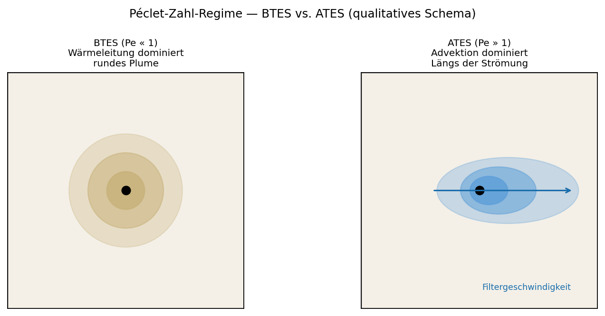
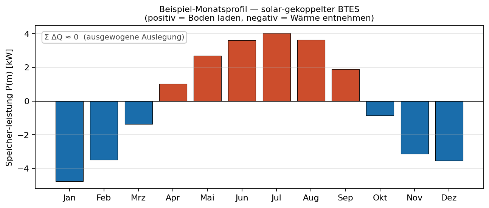
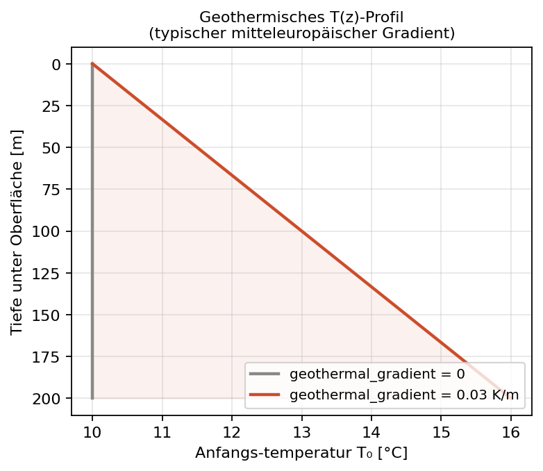
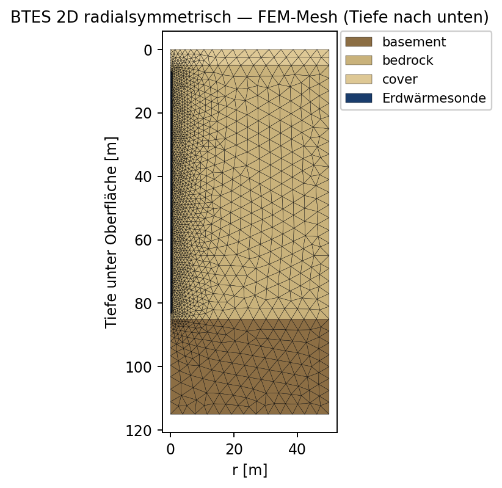
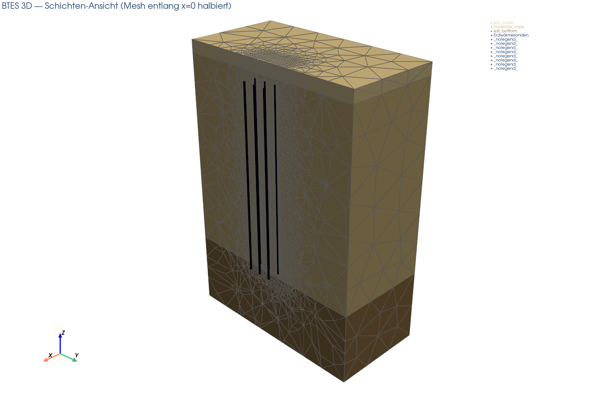
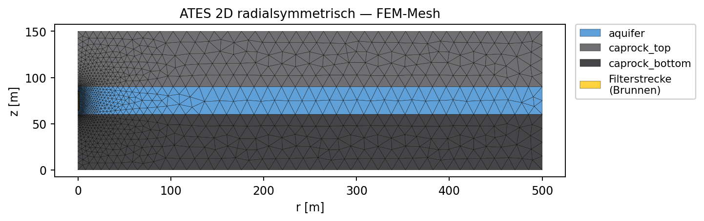
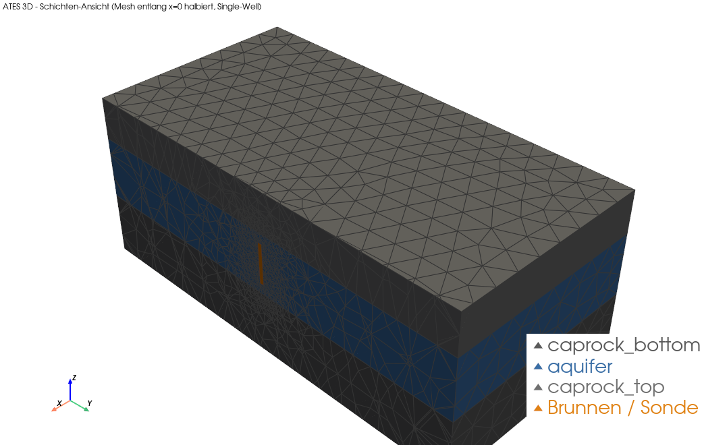
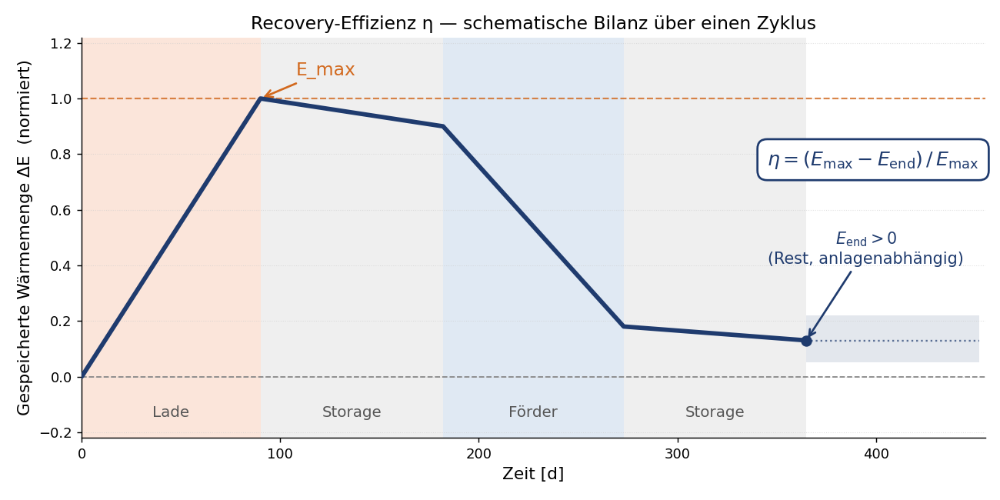

# Geothermische Untergrund-Wärmespeicher

Praktische Einführung in die Modellierung saisonaler Untergrund-Wärme­speicher
mit **OpenGeoSys 6**. Zwei Systemtypen, jeweils in 2D und 3D:

| System / Übung           | Geometrie                                            | Laufzeit (Default) |
|--------------------------|------------------------------------------------------|--------------------|
| `btes/ex1_2d`                     | BTES — radialsymmetrische Einzelsonde (2D, r-z)        | ~30 s      |
| `btes/ex2_3d`                     | BTES — Sondenfeld 3×3 in 3D (Volumenquelle)            | ~10–30 min |
| `btes/ex2_3d` · `btes_3d_bhe.py`  | BTES 3D fortgeschritten — echte U-Rohr-Sonden (`HEAT_TRANSPORT_BHE`, §7.3) | ~15–20 min |
| `ates/ex1_2d`                     | ATES — radialsymmetrischer Single-Well (2D, r-z)       | ~1 min     |
| `ates/ex2_3d`                     | ATES — Single-Well in 3D                               | ~15–60 min |
| `ates/ex2_3d` · `ates_3d_line.py` | ATES 3D fortgeschritten — Brunnen als 1D-Element (§8.3) | ~15–60 min |

---

## Inhaltsverzeichnis

1. Motivation
2. Physikalische Grundlagen
3. Konzepte: BTES und ATES
4. Numerisches Modell
5. Installation
6. Konfiguration & Mesh
7. BTES — Übungen
8. ATES — Übungen
9. Interpretation der Plots
10. Fehlersuche
11. Literatur

---

## 1. Motivation

Wärme ist der größte Posten im Endenergieverbrauch — in Deutschland
entfällt über die Hälfte der Endenergie auf Wärme, der überwiegende
Teil davon auf Raum- und Prozesswärme. Im Zuge der Wärmewende rückt
damit die Frage in den Vordergrund, wie sich Wärme über die
Jahreszeiten speichern lässt: Wärme­angebot (Solarthermie,
Industrie­abwärme) und Heiz­bedarf fallen zeitlich auseinander —
Überschuss im Sommer, Defizit im Winter. Klassische
**Puffer­speicher** (oberirdische Wasser­tanks, in denen Wärme in
einem geschlossenen Volumen gespeichert wird) sind teuer und
volumen­begrenzt. Der Untergrund selbst kann die Speicher­aufgabe
übernehmen — mit einem sehr großen, kostengünstigen
Speicher­volumen, dessen nutzbare Größe allerdings von
Hydrogeologie, Genehmigung und konkurrierenden Nachbar­nutzungen
begrenzt wird.

Zwei Konzepte dominieren:

- **BTES — Borehole Thermal Energy Storage** (*Erdwärmesonden­speicher*):
  Wärme­träger­fluid zirkuliert in vertikalen Sonden, übergibt Wärme
  über die Sondenwand leitungs­gebunden ins Festgestein.
  **Geschlossener Kreislauf** (closed loop), getrennt vom Grundwasser.
- **ATES — Aquifer Thermal Energy Storage** (*Aquifer­speicher*):
  Wasser eines permeablen Aquifers wird als Speicher­medium genutzt.
  Heißes oder kaltes Wasser wird über Brunnen ein- und ausgespeist.
  **Offener Kreislauf** (open loop).

Beide nutzen denselben saisonalen Zyklus: charge (Sommer) →
storage → discharge (Winter) → storage. Über mehrere Jahre stellt
sich ein quasi-stationärer Betrieb ein.

In diesem Übungsskript simulierst du beide Systeme mit OpenGeoSys in
2D und 3D und untersuchst über Parameterstudien, wie
Speicher­kapazität, Recovery-Effizienz und Reichweite der Wärmefahne
von Material, Betrieb und Geometrie abhängen.

---

## 2. Physikalische Grundlagen

### 2.1 Gekoppelter Strömungs- und Wärmetransport

In einem porösen Medium gelten zwei Erhaltungs­gleichungen.

**Massenbilanz­gleichung (Kontinuitäts­gleichung, Druck­form):**

$$
S\,\frac{\partial p}{\partial t} + \nabla\cdot(\rho_f\,\mathbf{q}) = Q_m
$$

mit *p* = Porendruck [Pa], *S* = Speicher­koeffizient [1/Pa],
*ρ*~f~ = Fluid­dichte [kg/m^3^], *q* = Filter­geschwindigkeit
(Darcy-Geschwindigkeit) [m/s], *Q~m~* = volumetrischer
Massen­quellterm [kg/(m^3^·s)].

**Darcy-Gesetz:**

$$
\mathbf{q} = -\frac{k}{\mu}\left(\nabla p - \rho_f\,\mathbf{g}\right)
$$

mit *k* = Permeabilität [m^2^], *μ* = Viskosität [Pa·s],
*g* = Schwerkraft.

**Wärmetransport­gleichung:**

$$
(\rho c_p)_\mathrm{eff}\,\frac{\partial T}{\partial t} + \rho_f c_{p,f}\,\mathbf{q}\cdot\nabla T - \nabla\cdot(\lambda_\mathrm{eff}\,\nabla T) = Q_h
$$

mit *T* = Temperatur [K], (ρc~p~)~eff~ = effektive volumetrische
Wärme­kapazität, λ~eff~ = effektive Wärme­leitfähigkeit, *Q~h~* =
Wärmequell­term [W/m^3^]. Der Advektions­term ist nur
wirksam, wenn Wasser strömt — bei einer quasi-impermeablen Bodenmatrix (BTES, Pe ≪ 1) praktisch
null, bei strömungsdominierten Aquiferen (ATES) dominierend. Enthält
ein BTES-Modell ausnahmsweise eine nennenswerte Grundwasserströmung,
gilt diese Vernachlässigung nicht.

OpenGeoSys nennt diesen gekoppelten Prozess **HT** (Hydro-Thermal).

Beiden Übungs-Systemen liegt die Annahme des **lokalen thermischen
Gleichgewichts** zugrunde: Fluid und Korngerüst haben in jedem Punkt
dieselbe Temperatur *T*, sodass eine einzige Wärmegleichung mit den
effektiven Parametern aus Abschnitt 2.2 genügt. Die dichte- und damit
auftriebsgetriebene Strömung (thermischer Ausdehnungs­koeffizient
*β*) ist optional und wird erst in den 3D-Übungen betrachtet
(Abschnitt 6.5, 8.2).

### 2.2 Effektive Materialparameter

Volumen­gewichtete Mischung aus Fluid- und Festkörper­anteilen:

$$
(\rho c_p)_\mathrm{eff} = \phi\,\rho_f c_{p,f} + (1-\phi)\,\rho_s c_{p,s}
$$

$$
\lambda_\mathrm{eff} = \phi\,\lambda_f + (1-\phi)\,\lambda_s
$$

mit *φ* = Porosität, Index *f* = Wasser, Index *s* = Korngerüst.

Die volumengewichtete (arithmetische) Mischung für λ~eff~ ist
eine Näherung und liefert tendenziell eine Obergrenze. Reale poröse
Medien liegen je nach Gefüge näher am geometrischen Mittel. Für die
Lehrmodelle hier ist die arithmetische Form ausreichend.

### 2.3 Péclet-Zahl: Verhältnis Advektion zu Wärme­leitung

Die **Péclet-Zahl** ist die dimensions­lose Kennzahl, die das
Verhältnis von advektivem Wärme­transport (mit der Strömung) zu
leitungs­gebundenem Wärme­transport beschreibt. Sie entscheidet,
welcher Mechanismus den Energie­transport im porösen Medium
dominiert:

$$
\mathrm{Pe} = \frac{v\,L\,\rho_f c_{p,f}}{\lambda_\mathrm{eff}}
$$

- **Pe ≪ 1**: Wärme­leitung dominiert → **BTES-Regime**.
- **Pe ≫ 1**: Advektion dominiert → **ATES-Regime**.



Bei BTES ist die Permeabilität des Festgesteins typisch
*k* ≈ 10^-18^ m^2^, d. h. *q* ≈ 0 m/s und Pe → 0.
Praktisch reduziert sich das BTES-Problem auf reine transiente
Wärme­leitung. Bei ATES ist *k* ≈ 10^-12^ m^2^ →
messbare Filter­geschwindigkeit |q| ≈ 10^-7^–10^-6^ m/s. Das advektive Plume folgt der Strömung.

### 2.4 Thermische Dispersion

In porösen Medien zerstreut die mikroskopische Geschwindigkeits­varianz
zwischen Poren die thermische Front zusätzlich zur reinen Leitung.
Modelliert durch einen Dispersions­tensor mit Längs- und
Quer­dispersivität (`dispersion.alpha_L_m`, `alpha_T_m`).

---

## 3. Konzepte: BTES und ATES

### 3.1 BTES — Sonden als volumetrische Quellen

In den Grundübungen (BTES 2D und 3D) wird das U-Rohr **nicht** im
Detail aufgelöst. Stattdessen wird jede Sonde durch ein kleines Volumen
approximiert, in dem ein volumetrischer Wärme­quell­term wirkt:

$$
Q_h(t) = \frac{P_\mathrm{Sonde}(t)}{V_\mathrm{Sonde}}
$$

mit *P~Sonde~* der pro Sonde eingespeisten Leistung [W]. *P~Sonde~(t)*
schaltet zyklus­synchron: +P~nenn~ (Lade), 0 (Storage), −P~nenn~
(Förder), 0 (Storage). Die Schaltkante wird durch eine **Rampe**
(`ramp_days`) geglättet.

> **Genauere Variante mit echten Rohrmodulen.** Wer die Sonden
> physikalisch detaillierter abbilden will, nutzt statt der
> Volumen­quelle das OGS-Modul **`HEAT_TRANSPORT_BHE`** (Skript
> `btes_3d_bhe.py`) mit explizitem U-Rohr, Grout und Refrigerant —
> siehe Abschnitt 7.3.

**Mehrschicht-Boden­modell.** Der Untergrund wird durch eine Liste
von Bodenschichten beschrieben (Konfig­block `layers`, Reihenfolge
**von oben nach unten**). Jede Schicht hat eigene
Werte für Schichtdicke, Permeabilität, Porosität, Dichte,
Wärme­kapazität und Wärme­leitfähigkeit. Die Sonde wird unabhängig
davon über `borehole.depth_top_m` und `borehole.depth_bottom_m`
positioniert (Tiefe **gemessen von der Oberfläche nach unten**) und
kann mehrere Schichten durchstoßen.

Die konkreten `CONFIG`-Blöcke (`layers`, `borehole`, Material) sind
gesammelt in Kapitel 6 (Abschnitt 6.1) dokumentiert.

Mesh-Generierung und PRJ-Erzeugung passen sich automatisch an: jede
Schicht bekommt ihre eigene MaterialID, die Sonde liegt als
zusätzliches Volumen mit eigenem Wärmequell­term darüber.

### 3.2 ATES — Brunnen als Quell-/Senke-Term

Der Aquifer ist eine permeable Schicht
(typisch *k* ≈ 10^-12^ m^2^), nach oben und unten
durch dichtes **Cap Rock** begrenzt (*k* ≈ 10^-18^
m^2^). Wärme entweicht aus dem Aquifer fast nur
leitungs­gebunden.

In den Übungen wird der Brunnen vereinfacht modelliert:

- **Druckgleichung**: volumetrischer Massen­quell­term ±Q~m~/V~screen~
  im Filtervolumen.
- **Temperaturgleichung**: Dirichlet-Randbedingung auf der
  Filter-Subdomäne. Während Injektion = T~inj~, sonst ≈ T~0~.

**Genauere Brunnenmodelle.** Diese Vereinfachung (Dirichlet-Randbedingung der Temperatur am
Brunnen­filter) ist numerisch stabil, aber idealisiert. In der
Förder­phase pinnt sie die Brunnen­temperatur künstlich. Eine
physikalisch korrektere Alternative ist eine **Neumann-Randbedingung
2. Art** (vorgegebener Wärme­strom $q_n = \dot{m}\,c_{p,f}\,\Delta T$
auf der Filter-Innen­fläche). Diese erfordert in OGS HT zusätzliche
Stabilisierung (SUPG). Für die hier vorgesehene Auslegungs­studie
ist die Dirichlet-Variante ausreichend. Eine genauere Brunnen-*Geometrie*
— der Brunnen als hochpermeables 1D-Element statt als Filterbox — wird in
Abschnitt 8.3 behandelt.

**Single-Well-Modus.** Alle ATES-Übungen verwenden einen **einzigen
aktiven Brunnen**. Der Brunnen injiziert in der
Lade­phase und fördert in der Förder­phase aus derselben Filterstrecke.
Damit das injizierte Wasser entweichen kann, wird der Lateral­rand
des Aquifers als Druck-Outlet gesetzt. Im **„ruhenden Aquifer"-Modus**
(Default) ist dort *p* = 0 — kein regionaler Grundwasser­fluss. Über
`regional_gw.enable = True` (ATES 3D) lässt sich auf der
Lateral­fläche ein **linearer Druckgradient** statt konstantem *p* = 0
aufprägen — siehe Konfigurations­parameter in Abschnitt 8.2.

### 3.3 Filterstrecke (ATES)

Der Brunnen ist nur in einem Höhen­abschnitt des Aquifers offen
(Filterstrecke), als Box mit `screen_top_offset_m` von oben und
`screen_bottom_offset_m` von unten definiert. Die Filter­permeabilität
(`screen_permeability_m2`, typ. 10^-9^ m^2^) ist
deutlich höher als die des Aquifers — Modell für den ausgekiesten
Brunnen­ausbau.

### 3.4 Randbedingungen — Übersicht

| System | Oberkante / Unterkante           | Lateralrand                                |
|--------|----------------------------------|--------------------------------------------|
| BTES   | Dirichlet *T*=*T*~0~, *p*=*p*~0~ | kein Fluss (2D: Symmetrieachse, 3D: isoliert) |
| ATES   | Dirichlet *T*=*T*~0~, *p*=*p*~0~ | Aquifer-Außenseite: Dirichlet *p*=0 (Outlet) |

### 3.5 Zwei Modi für den Zyklus

Die folgenden zwei Modi sind im Übungs-Setup vorgesehen. Prinzipiell
lässt sich die zeitliche Steuerung der Quell-/Senke-Terme in OGS noch
deutlich feiner aufschlüsseln (z. B. tages­genaue Profile, gekoppelte
Last- und Außen­temperatur­modelle). Die hier angebotenen Modi entsprechen einer in der Literatur
(Sheldon 2021) üblichen Art, den saisonalen Speicherbetrieb zu
modellieren.

**Modus A — 4-Phasen-Zyklus (Default).** Pro Zyklus vier Phasen mit
fester Dauer (charge, storage, discharge, storage). Konstante
Lade-/Förder­leistung (BTES) oder konstanter Massenstrom +
Vorlauf­temperatur (ATES). Steuerung über `cycles.charge_days`,
`discharge_days`, `storage_after_*_days`, `n_cycles`.

**Modus B — Monatsprofil.** Liste von 12 monatlichen Speicher­leistungen
[W]. Positiv = laden, negativ = fördern, 0 = Stillstand. Jeder Monat
dauert 365.25/12 ≈ 30.44 d, die Sequenz wird `n_cycles`-mal wiederholt
(Anzahl Betriebs­jahre). Aktiviert durch
`cycles.monthly_power_W = [P_Jan, …, P_Dez]`.

- **BTES**: monatliche Leistung *P* wird direkt als Wärmequell­term
  $Q_h = P / V_\mathrm{Sonde}$ aufgeprägt.
- **ATES**: aus *P* und der Vorlauf­temperatur *T~inj~* wird der
  Massenstrom berechnet:

$$
\dot{m} = \frac{P}{c_{p,f}\,(T_\mathrm{inj} - T_0)}
$$

mit *c~p,f~* = spez. Wärme­kapazität Wasser
(`fluid.cp_J_kgK`), *T~inj~* = Vorlauf­temperatur,
*T~0~* = anfängliche Aquifer­temperatur (`initial.T_K`).
Vorlauf­temperatur per Default: `T_hot_K` bei *P* > 0, `T_cold_K`
bei *P* < 0, optional pro Monat über `cycles.monthly_T_inj_K`.



### 3.6 Reservoirtiefe und geothermischer Gradient

**Reservoirtiefe.** Die Lage des nutzbaren Speicher­bereichs ergibt
sich aus der Schichtung:

- **BTES**: Der Speicher­bereich um die Sonde wird durch
  `borehole.depth_top_m` (Sondenkopf, Tiefe unter Oberfläche) und
  `borehole.depth_bottom_m` (Sondenfuß) festgelegt. Die Sonde kann
  mehrere Schichten aus `layers` durchstoßen.
- **ATES**: Die Tiefe des Aquifer­dachs unter Oberfläche ist
  `layers.caprock_top_thickness_m`. Die Aquifer­dicke gibt
  `layers.aquifer_thickness_m` vor. Beide Werte sind direkt
  konfigurierbar — der Brunnen­filter sitzt innerhalb des Aquifers.

**Geothermischer Gradient.** Statt einer konstanten
Anfangs­temperatur kann ein **tiefen­abhängiges** *T*~0~(*z*)
gesetzt werden:

$$
T_0(z) = T_\mathrm{surface} + \mathrm{grad}\cdot z
$$

Aktivierung über das CONFIG-Block `initial`:

```python
CONFIG["initial"]["T_surface_K"]                = 283.15   # 10 °C an der Oberfläche
CONFIG["initial"]["geothermal_gradient_K_per_m"] = 0.03    # typischer Wert ~ 3 K/100 m
```

Für die Übungen nimmt man einen geothermischen Gradienten an und legt
die Oberflächentemperatur fest — hier *T*~0~ = 10 °C (oder ein
vom Studierenden gewählter Wert). Die Skripte erzeugen daraus die
tiefenabhängige Anfangstemperatur *T*~0~(*z*).



Konsequenz: bei Mehrjahres­läufen mit Gradient ist
der „Hintergrund" am Sonden­fuß bereits wärmer als an der Erd­oberfläche
— die Recovery-Effizienz hängt damit zusätzlich von der Sondentiefe
ab.

---

## 4. Numerisches Modell

### 4.1 Diskretisierung

- **Finite-Elemente-Methode** (FEM) auf unstrukturierten Meshes.
- Netzgenerator: **gmsh**. Die Mesh-Strategie folgt einem drei­stufigen
  Verfeinerungs­schema:
  - **fein** innerhalb der Sonde / des Brunnen­filters
    (`mesh.size_in_borehole_m` bzw. `size_in_well_m`)
  - **mittel** im Nahbereich bis zu einem Übergangs­radius
    (`size_near_*`)
  - **grob** im Fernfeld (`size_far_m`) — dient nur als thermischer
    Puffer. Die Wärme­front erreicht diese Zone in typischen
    Laufzeiten kaum.

  Geometrisch wird die Verfeinerung in gmsh über ein
  **Distance + Threshold**-Field realisiert.
- Konvertierung gmsh → OGS-VTU über `ogstools.Meshes.from_gmsh`.

### 4.2 Zeitintegration

- Implizites Euler-Schema, fester Zeitschritt `time.dt_seconds`
  (Default je nach Übung 1–14 Tage). Kleinere Schritte → genauer,
  aber teurer.

### 4.3 Löser

- Linearer Löser, Default: **BiCGSTAB + ILUT-Vorkonditionierer** mit
  Skalierung — iterativer Löser, geeignet für die typischen
  Mesh­größen der Übungen. Toleranzen über `solver.linear_tol` und
  `solver.linear_iter` einstellbar.
- Der gekoppelte HT-Prozess wird äußerlich mit einem
  **Picard-Iterationsverfahren** (`basic_picard`, max.
  `solver.nonlinear_iter` Iterationen) gelöst. Das Konvergenz­kriterium
  prüft die relative Änderung von Temperatur und Druck.

### 4.4 Typische numerische Fallen

| Symptom                              | Ursache                            | Abhilfe                                              |
|--------------------------------------|------------------------------------|------------------------------------------------------|
| T-Spitzen über Injektions­wert       | Advektives Overshoot (Pe ≫ 1, ATES) | `dispersion.alpha_L_m` ↑ (5–10 m)                    |
| Negative T-Werte am Plume-Rand       | Mesh zu grob am Front-Knick         | Mesh feiner, Dispersivität ↑                         |
| „Singular matrix"                    | Zeitschritt zu groß / Ramp zu kurz  | `dt_seconds` halbieren, `ramp_days` ↑                |
| Druck­schwingungen am Brunnen        | Quell­term zu konzentriert (ATES)   | `screen_dx_m/dy_m` ↑ oder `screen_permeability_m2` ↑ |
| Konvergenz extrem langsam            | Mesh zu fein für ILUT-Pre           | `size_far_m` vergrößern                              |

---

## 5. Installation

Voraussetzungen: **Python 3.10–3.12**, Windows/Linux/macOS.

Im Wurzelverzeichnis des Projekts liegt eine `requirements.txt`:

```
python -m pip install --upgrade pip
python -m pip install -r requirements.txt
```

Pakete:

| Paket        | Zweck                                                |
|--------------|------------------------------------------------------|
| `ogs`        | OpenGeoSys 6 Python-Wheel (bringt `ogs.exe` mit)     |
| `ogstools`   | Mesh-Konvertierung gmsh → vtu                        |
| `gmsh`       | Netzgenerator                                        |
| `meshio`     | Mesh-I/O                                             |
| `numpy`      | Numerik                                              |
| `pyvista`    | Ergebnis-Auswertung                                  |
| `matplotlib` | Plots                                                |

`ogs.exe` muss im `PATH` auffindbar sein. Der pip-Install legt es in
`%LOCALAPPDATA%\…\Python311\Scripts` ab — dieses Verzeichnis ggf. dem
`PATH` hinzufügen.

---

## 6. Konfiguration & Mesh

Alle Stellschrauben liegen im `CONFIG`-Block oben im jeweiligen
Simulations-Skript (`btes_radial_2d.py`, `btes_3d.py`,
`ates_radial_2d.py`, `ates_3d.py`). `CONFIG` ist ein verschachteltes
Python-Dictionary. Dieses Kapitel dokumentiert die **gemeinsamen**
Blöcke, die in allen Übungen gleich aufgebaut sind. Die geometrie- und
systemspezifischen Schrauben stehen im jeweiligen Übungskapitel
(BTES: Kapitel 7, ATES: Kapitel 8).

### 6.1 Material & Schichten

**BTES — freie Schichtliste.** Der Untergrund ist eine Liste von
Bodenschichten (`layers`, Reihenfolge **von oben nach unten**). Jede
Schicht trägt eigene Materialwerte. Mesh- und PRJ-Erzeugung vergeben
pro Schicht automatisch eine MaterialID. Die Sonde wird unabhängig
davon über `borehole.depth_top_m`/`depth_bottom_m` (Tiefe von der
Oberfläche) positioniert und kann mehrere Schichten durchstoßen.

```python
CONFIG["layers"] = [
    {"name": "cover",    "thickness_m":  5.0,
     "permeability_m2": 1.0e-15, "porosity": 0.35,
     "rho_s_kg_m3": 1900, "cp_s_J_kgK": 1500, "lambda_s_W_mK": 1.4},
    {"name": "bedrock",  "thickness_m": 80.0,
     "permeability_m2": 1.0e-18, "porosity": 0.20,
     "rho_s_kg_m3": 2700, "cp_s_J_kgK":  900, "lambda_s_W_mK": 2.5},
    {"name": "basement", "thickness_m": 30.0,
     "permeability_m2": 1.0e-19, "porosity": 0.10,
     "rho_s_kg_m3": 2750, "cp_s_J_kgK":  850, "lambda_s_W_mK": 3.0},
]
CONFIG["borehole"] = {"r_borehole_m": 0.5, "depth_top_m": 7.0, "depth_bottom_m": 83.0}
```

Im 3D-Sondenfeld (`btes_3d.py`) tritt an die Stelle des 2D-Radius
`r_borehole_m` der Box-Querschnitt `borehole.borehole_dx_m`/`borehole_dy_m`.
Die Schichtliste `layers` und `borehole.depth_top_m`/`depth_bottom_m`
sind identisch zur 2D-Übung.

**ATES — Aquifer zwischen Cap-Rock.** Statt einer freien Liste eine
feste Drei-Schicht-Struktur: ein permeabler Aquifer (Speicher) zwischen
dichtem oberen und unterem Cap Rock. Die Mächtigkeiten stehen in
`layers` (Kapitel 8), die Materialwerte in `materials.aquifer`,
`materials.caprock_top`, `materials.caprock_bottom`:

```python
CONFIG["materials"]["aquifer"] = {
    "permeability_m2": 1.0e-12, "porosity": 0.25,
    "rho_s_kg_m3": 2650, "cp_s_J_kgK": 1000, "lambda_s_W_mK": 3.0,
}
CONFIG["materials"]["caprock_top"] = {        # dicht, dämmt nach oben
    "permeability_m2": 1.0e-18, "porosity": 0.05,
    "rho_s_kg_m3": 2700, "cp_s_J_kgK":  900, "lambda_s_W_mK": 2.0,
}
CONFIG["materials"]["caprock_bottom"] = { ... }   # analog caprock_top
```

Materialschlüssel (identisch für BTES-Schichten und ATES-Materialien):

| Schlüssel         | Bedeutung                            |
|-------------------|--------------------------------------|
| `lambda_s_W_mK`   | Wärmeleitfähigkeit des Korngerüsts   |
| `cp_s_J_kgK`      | spez. Wärmekapazität (Korn)          |
| `rho_s_kg_m3`     | Dichte des Korngerüsts               |
| `porosity`        | Porosität                            |
| `permeability_m2` | Permeabilität                        |

Die Fluid-Eigenschaften des Wassers werden in Abschnitt 6.5
beschrieben.

### 6.2 Betrieb

Der `operation`-Block unterscheidet sich je System:

| System | Schlüssel                          | Bedeutung                              |
|--------|------------------------------------|----------------------------------------|
| BTES   | `operation.power_per_borehole_W`   | Heiz-/Kühl-Leistung pro Sonde [W]      |
| ATES   | `operation.mass_flow_rate_kg_s`    | Massenstrom je Brunnen [kg/s]          |
| ATES   | `operation.T_hot_K` / `T_cold_K`   | Vorlauftemperatur Lade-/Förder-Phase [K] |

### 6.3 Zyklen (Modus A & B)

Beide Systeme teilen dieselbe Zyklenlogik (vgl. Abschnitt 3.5).

**Modus A — 4-Phasen-Zyklus (Default).**

| Parameter                             | Bedeutung                            |
|---------------------------------------|--------------------------------------|
| `cycles.n_cycles`                     | Anzahl Zyklen (A) bzw. Jahre (B)     |
| `cycles.charge_days`                  | Lade-Phasendauer [d]                 |
| `cycles.discharge_days`               | Förder-Phasendauer [d]               |
| `cycles.storage_after_charge_days`    | Pause nach Beladung [d]              |
| `cycles.storage_after_discharge_days` | Pause nach Förderung [d]             |
| `cycles.ramp_days`                    | Übergangsrampe (Stabilität) [d]      |
| `cycles.monthly_power_W`              | `None` → Modus A aktiv               |

**Modus B — Monatsprofil.** Liste von 12 Monatsleistungen [W]
(positiv = laden, negativ = fördern, 0 = Stillstand). Der Modus ist aktiv, sobald
`monthly_power_W` ≠ `None`. Bei ATES kann zusätzlich
`cycles.monthly_T_inj_K` (12 Werte) die monatliche Vorlauftemperatur
vorgeben.

```python
# BTES-Beispiel
CONFIG["cycles"]["monthly_power_W"] = [+2000, +2000, +1500, +500, 0, 0,
                                         0, 0, -1500, -2500, -3000, -2500]
# ATES-Beispiel (größere Leistungen)
CONFIG["cycles"]["monthly_power_W"] = [+80_000, +60_000, +30_000, 0, 0, 0,
                                         0, 0, -30_000, -60_000, -90_000, -90_000]
```

Die Referenzleistung (BTES `power_per_borehole_W` bzw. ATES
`mass_flow_rate_kg_s`) dient im Monatsmodus als Skalierungsgröße.

### 6.4 Mesh & Diskretisierung (2D und 3D)

Das Mesh wird mit **gmsh** dreistufig verfeinert (fein in Sonde/
Brunnenfilter, mittel im Nahbereich, grob im Fernfeld — vgl.
Abschnitt 4.1). Dieselben Schrauben gelten für **2D-Radial- und
3D-Modelle** — nur die Schlüsselnamen unterscheiden sich leicht
zwischen BTES und ATES:

| BTES-Schlüssel             | ATES-Schlüssel            | Bedeutung                              |
|----------------------------|---------------------------|----------------------------------------|
| `mesh.size_in_borehole_m`  | `mesh.size_in_well_m`     | Elementgröße in Sonde/Filter (fein) [m] |
| `mesh.size_near_field_m`   | `mesh.size_near_well_m`   | Elementgröße im Nahbereich (mittel) [m] |
| `mesh.size_far_m`          | `mesh.size_far_m`         | Elementgröße im Fernfeld (grob) [m]     |
| —                          | `mesh.well_size_radius_m`, `well_size_radius_far_m` | Übergangsradien fein→grob [m] |

Im 2D-Radialmodell wirken sie auf die (*r*, *z*)-Halbebene, im
3D-Modell auf das Volumenmesh. Der grobe Fernfeld-Wert dient nur als
thermischer Puffer. Die Wärmefront erreicht diese Zone in typischen
Laufzeiten kaum.

### 6.5 Fluid & Dispersion

| Parameter                              | Bedeutung                                       |
|----------------------------------------|-------------------------------------------------|
| `fluid.cp_J_kgK`, `lambda_W_mK`        | Wärmekapazität / -leitfähigkeit des Wassers     |
| `fluid.viscosity_Pa_s`, `rho_ref_kg_m3`| Viskosität, Referenzdichte                      |
| `fluid.beta_1_per_K`                   | therm. Ausdehnungskoeffizient (Auftrieb, 0 = aus) |
| `dispersion.alpha_L_m`, `alpha_T_m`    | longitudinale / transversale Dispersivität [m]  |

Die Fluid-Werte sind **konstante** Vorgaben, nicht temperatur- oder
druckabhängig.

> Bei BTES sind Advektion und Dispersion meist vernachlässigbar
> (quasi-impermeable Matrix, Pe ≪ 1). Bei ATES bestimmen
> `alpha_L_m`/`alpha_T_m` die Aufweitung der Wärmefront maßgeblich.

### 6.6 Anfangszustand, Löser, Zeit, Ausgabe

| Block      | Wichtige Schlüssel                                              |
|------------|----------------------------------------------------------------|
| `initial`  | `T_K`, `p_Pa`, optionaler geothermischer Gradient (Abschnitt 3.6) |
| `time`     | `dt_seconds` (Zeitschritt), `output_every_n_steps`, `gravity`  |
| `solver`   | `linear_tol`, `linear_iter`, `nonlinear_iter`, `rel_tol_T/p`   |
| `output`   | `prefix`, `out_dir`, `variables`                               |

Die Randbedingungen sind in Abschnitt 3.4 zusammengefasst.

---

## 7. BTES — Übungen

> Die Aufgaben sind **nicht abgabepflichtig**. Es geht darum, sich mit dem
> Thema auseinanderzusetzen und den Umgang mit der Finite-Elemente-Simulation
> zu üben. Die gemeinsamen CONFIG-Blöcke sind zentral in **Kapitel 6**. Je
> Übung sind unten nur die spezifischen Schrauben aufgeführt.

Zielgrößen pro Lauf: max. T am Sondenrand T~max~ (Plot 1), max.
gespeicherte Energie E~max~ (Plot 3), Recovery-Effizienz η (Plot 3),
max. Reichweite r(ΔT>1 K) (Plot 4), Plume-Form (Plot 2).

### 7.1 BTES 2D radialsymmetrisch (Übung 1)

Eine einzelne vertikale Sonde auf der Symmetrie-Achse *r* = 0. Das 3D-Problem
wird durch Annahme rotationssymmetrischer Lösung auf 2D in der (*r*,
*z*)-Halbebene reduziert. Vorteil: 100–1000× weniger Zellen als 3D, Laufzeit
in Sekunden.



**Ausführen:**

```
cd btes/ex1_2d
python btes_radial_2d.py     # Mesh + Simulation
python plot_results.py       # Plots → figures/
```

**Relevante Konfiguration** (gemeinsame Blöcke siehe Kapitel 6):

| Parameter                                | Bedeutung                                |
|------------------------------------------|------------------------------------------|
| `borehole.r_borehole_m`                  | Sondenradius [m]                         |
| `borehole.depth_top_m`                   | Sondenkopf, Tiefe unter Oberfläche [m]   |
| `borehole.depth_bottom_m`                | Sondenfuß, Tiefe unter Oberfläche [m]    |
| `layers` (Liste)                         | Bodenschichten (oben→unten), je eigene Materialwerte |
| `domain.r_max_m`                         | Modellradius (lateral) [m]               |
| `operation.power_per_borehole_W`         | Heiz-/Förderleistung pro Sonde [W]       |

**Aufgaben:**

**Aufgabe B1 — Wärmeleitfähigkeit des Festgesteins**
Setze `materials.soil.lambda_s_W_mK` auf 1.5, 2.5, 4.0 W/(m·K) (typische
Spannweite Lockergestein → Festgestein). Optional zusätzlich 0.8 und 5.0
W/(m·K) für die Extreme. Trage T~max~, η und max. Reichweite in eine
Tabelle ein und ordne ein, welche Größen mit λ steigen bzw. fallen.
**Erweiterung:** dieselbe Studie für `materials.soil.cp_s_J_kgK` (750–2000
J/(kg·K)) und `rho_s_kg_m3` (1800–2900 kg/m³), um den Einfluss der
volumetrischen Wärmekapazität (ρ·c~p~) zu isolieren.

**Aufgabe B2 — Heiz-/Förderleistung**
Setze `operation.power_per_borehole_W` auf 1000, 2000 und 5000 W. Vergleiche
T~max~ und E~max~. Prüfe, ob T~max~ linear oder
überproportional skaliert und beurteile, ab welcher Leistung das Modell
unrealistische T-Werte (z. B. > 80 °C im Festgestein) liefert.

**Aufgabe B3 — Anzahl der Zyklen**
Setze `cycles.n_cycles` auf 1, 3 und 5. Lies in Plot 1 ab, wie sich die
Basistemperatur am Sondenrand am Ende jedes Zyklus ändert. Bestimme: nach
welcher Zyklenzahl ist die Änderung von Zyklus zu Zyklus < 0.5 K
(Einschwingkriterium)?

**Aufgabe B4 — Asymmetrischer Zyklus**
Setze `cycles.charge_days = 120`, `storage_after_charge_days = 60`,
`discharge_days = 120`, `storage_after_discharge_days = 60` und vergleiche mit
dem symmetrischen Default (alle 91.25 d). Vergleiche η und max. Reichweite.

**Aufgabe B5 — Sondenlänge**
Variiere die Sondenlänge über `borehole.depth_bottom_m` (bei
`depth_top_m = 7`: 47, 87, 127 m → Längen 40, 80, 120 m). Bestimme
E~max~/Länge [GJ/m] und prüfe, ob die volumetrische Energiedichte
konstant bleibt.

**Aufgabe B6 — Monatsprofil**
Aktiviere Modus B (siehe Abschnitt 6.3) mit `n_cycles = 3`. Lies aus Plot 1
ab, ob sich die Sondentemperatur am Ende von Jahr 1, 2, 3 unterscheidet
(Einschwingen).

**Aufgabe B-AsymZyklen — Recovery-Verluste durch Asymmetrie**
Im symmetrischen Default-Zyklus (91.25 / 91.25 / 91.25 / 91.25) ist η ≈ 100 %,
weil Lade- und Förderphase exakt dieselbe Energie bewegen. Erzeuge ein
verlustbehaftetes Szenario:

```python
# Asymmetrie 2:1 — doppelt so lange laden wie fördern
CONFIG["cycles"]["charge_days"]                  = 120.0
CONFIG["cycles"]["storage_after_charge_days"]    = 30.0
CONFIG["cycles"]["discharge_days"]               = 60.0
CONFIG["cycles"]["storage_after_discharge_days"] = 30.0
```

Lies η ab und vergleiche mit dem symmetrischen Default. Erweitere mit
`n_cycles = 3` und dünnem Cover (`layers[0]["thickness_m"] = 1.0`), um die
Verluste nach oben zu verstärken. η fällt typisch unter 25 %.

**Aufgabe B-Solar — Solar-gekoppeltes Monatsprofil**
Verknüpfung der Solarthermie-Übung (Geothermie 4 / Übung 2): die dort
berechneten monatlichen Speicherleistungen *P*(*m*) werden als Last in den
Bodenspeicher eingespielt — eine eigene Solarfeld-Auslegung ist hier nicht
nötig. Trage die Werte so ein, als wären sie die Last deines Bodenspeichers.
Dieser Untergrund dient nur zur Verknüpfung mit Übung 2 und ist nicht der
Untergrund der eigentlichen Übung.

1. Übernimm die 12 Monatswerte `monthly_power_W` aus deiner Solarthermie-Übung
   (positiv = laden im Sommer, negativ = fördern im Winter) und setze sie in
   `CONFIG["cycles"]["monthly_power_W"]`.
2. `cycles.n_cycles = 3` (drei Betriebsjahre).

Lies η, T~max~ und max. Reichweite ab. Ordne ein: Lädt sich der
Bodenspeicher über die drei Jahre netto auf, entlädt er sich, oder schwingt er
sich ein?

### 7.2 BTES 3D Sondenfeld (Übung 2)

Quaderförmiges Bodenvolumen mit einem **3×3-Sondenfeld** (Default-Abstand 5
m). Jede Sonde als kleines Volumen mit volumetrischem Wärmequellterm. Volles
3D, ~50.000–150.000 Zellen.



**Ausführen:**

```
cd btes/ex2_3d
python btes_3d.py            # 10–30 min
python plot_results.py
```

Tipp: vorab Setup prüfen mit `python btes_3d.py --no-run`.

**Relevante Konfiguration** (gemeinsame Blöcke siehe Kapitel 6):

| Parameter                                | Bedeutung                                  |
|------------------------------------------|--------------------------------------------|
| `field.n_x`, `field.n_y`                 | Sondenraster (x × y)                       |
| `field.spacing_m`                        | Sondenabstand [m]                          |
| `field.positions`                        | Optional explizite Liste `[(x,y), …]`      |
| `borehole.borehole_dx_m`, `borehole_dy_m` | Sondenvolumen (x, y)-Ausdehnung [m]       |
| `borehole.depth_top_m`, `depth_bottom_m` | Sondenkopf/-fuß, Tiefe unter Oberfläche [m] |
| `layers` (Liste)                         | Bodenschichten (oben→unten), je eigene Materialwerte |
| `operation.power_per_borehole_W`         | Heiz-/Förderleistung pro Sonde [W]         |

**Aufgaben:**

**Aufgabe B7 — Sondenabstand**
Setze `field.spacing_m` auf 3, 5, 8 m. Vergleiche T~max~ im Zentrum
und am Rand des Felds. Bestimme den Mindestabstand, ab dem
T~max,Zentrum~ − T~max,Außen~ < 2 K
(Wechselwirkungsschwelle).

**Aufgabe B8 — Feldgeometrie**
Wechsle von 3×3 (Default) auf 1×9 (Linienfeld, `field.n_x = 9`, `field.n_y =
1`). Vergleiche bei sonst gleichen Parametern E~max~, η und max.
Reichweite.

**Aufgabe B9 — Mehrjahresvorwärmung**
Setze `cycles.n_cycles = 3`. Lies aus Plot 1 die zentrale Sondentemperatur am
Ende von Jahr 1, 2, 3 ab. Bestimme die „Vorwärmung" T~Ende,Jahr\ 3~ −
T~0~.

**Aufgabe B10 — Leistungsskalierung**
Setze `operation.power_per_borehole_W` auf 1000, 2000, 3000, 5000 W. Bestimme
den Wert, bei dem T~max,Zentrum~ = 30 °C erreicht wird (lineare
Interpolation). Lies η für jeden Lauf ab.

> **Grundwassereinfluss bei BTES.** Die Bodenmatrix ist standardmäßig mit *k*
> ≈ 10^-18^ m^2^ quasi-impermeabel. Eine regionale
> Grundwasserströmung wirkt sich auf den Wärmetransport kaum aus (Pe ≪ 1).
> Soll der Effekt dennoch untersucht werden, erlaubt
> `materials.soil.permeability_m2` eine Variation hin zu klüftigem Untergrund
> (z. B. 10^-14^ m^2^).

### 7.3 BTES 3D — fortgeschritten: Echte U-Rohr-Sonden (`HEAT_TRANSPORT_BHE`)

Dieses Modell ist dasselbe geschichtete BTES wie Übung 7.2 — identischer
Schichtaufbau (`layers`, jede Schicht mit eigenem Material) und dieselbe
Sondenpositionierung über `borehole.depth_top_m`/`depth_bottom_m`. Der
Unterschied liegt allein in der Sonde: Statt sie als vereinfachte
Volumen-Wärmequelle aufzuprägen, löst `btes_3d_bhe.py` sie über das OGS-Modul
**`HEAT_TRANSPORT_BHE`** physikalisch auf:

- Jede Sonde ist ein **1D-Linienelement**, das ins 3D-Bodenmesh eingebettet
  ist. Über die gemeinsamen Knoten läuft der Wärmeaustausch zwischen
  Refrigerant und Erdreich.
- Im Bohrloch sitzt eine explizite **U-Rohr-Geometrie** (Vor- und Rücklauf),
  umgeben von **Grout** (Verfüllung). Im Rohr zirkuliert ein **Refrigerant**.
- Der Sondentyp ist wählbar: **1U**, **2U**, **CXA**, **CXC**.
- Die Steuerung `FixedPowerConstantFlow` gibt eine feste Leistung pro Sonde
  bei konstantem Volumenstrom vor. OGS bestimmt daraus die Vor- und
  Rücklauftemperatur des Refrigerants.

Der Bohrloch-Wärmewiderstand aus Rohr-, Grout- und Refrigerant-Eigenschaften
bestimmt, wie gut die Leistung ins Erdreich übergeht — der physikalische
Mehrwert gegenüber der Volumenquelle, die diesen Widerstand nicht kennt.

**Ausführen:**

```
cd btes/ex2_3d
python btes_3d_bhe.py     # 3×3-Feld, Typ 1U, ~15–20 min
python plot_results.py    # erkennt die BHE-Ausgabe automatisch
```

**Relevante Konfiguration** (Block `CONFIG["bhe"]`):

| Schlüssel                                     | Bedeutung                                   |
|-----------------------------------------------|---------------------------------------------|
| `type`                                        | Sondentyp `1U`, `2U`, `CXA`, `CXC`          |
| `borehole.diameter_m`                         | Bohrdurchmesser [m]                         |
| `pipes.diameter_outer_m`, `wall_thickness_m`  | Rohr-Geometrie [m]                          |
| `pipes.distance_between_pipes_m`              | Achsabstand Vor- und Rücklauf [m]           |
| `grout.*`                                     | Verfüllung (Dichte, c_p, λ)                 |
| `refrigerant.*`                               | Wärmeträgerfluid (Dichte, η, c_p, λ)        |
| `control.power_W`                             | Leistung pro Sonde [W]                      |
| `control.flow_rate_kg_s`                      | Massenstrom pro Sonde [kg/s]                |

> In `CONFIG` steht der Massenstrom in kg/s. Das Skript rechnet ihn intern in
> den von OGS verlangten Volumenstrom (m³/s) um.

**Aufgaben:**

**Aufgabe B-BHE1 — Sondentyp**
Setze `bhe.type` nacheinander auf `1U`, `2U` und `CXA`. Vergleiche bei
gleicher Leistung, wie stark sich das Erdreich um die zentrale Sonde erwärmt.
Ordne ein, welcher Typ den besten Wärmeübergang ins Erdreich liefert.

**Aufgabe B-BHE2 — Verfüllung (Grout)**
Setze `bhe.grout.thermal_conductivity_W_mK` auf 0.8, 2.3 und 4.0 W/(m·K).
Beurteile, wie die Grout-Leitfähigkeit den Bohrloch-Wärmewiderstand und damit
die Refrigerant-Temperatur beeinflusst.

**Aufgabe B-BHE3 — Massenstrom und Refrigerant-Spreizung**
Setze `bhe.control.flow_rate_kg_s` auf 0.1, 0.2 und 0.4 kg/s. Die Spreizung
zwischen Vor- und Rücklauf ist näherungsweise *P* / (ṁ · c). Prüfe, ob sich
die Spreizung bei Halbierung des Massenstroms verdoppelt.

**Aufgabe B-BHE4 — Rohrabstand (Shank Spacing)**
Setze `bhe.pipes.distance_between_pipes_m` auf 0.03, 0.05 und 0.08 m. Ein
größerer Abstand der Rohrschenkel verringert den thermischen Kurzschluss
zwischen Vor- und Rücklauf. Beurteile die Wirkung auf die Sondentemperatur.

---

## 8. ATES — Übungen

> Alle ATES-Übungen sind als **Single-Well-Anlage** ausgelegt (ein aktiver
> Brunnen, der in der Ladephase injiziert und in der Förderphase aus
> derselben Filterstrecke entnimmt).

> Die Aufgaben sind **nicht abgabepflichtig**. Es geht darum, sich mit dem
> Thema auseinanderzusetzen und den Umgang mit der Finite-Elemente-Simulation
> zu üben. Die gemeinsamen CONFIG-Blöcke (Material, Betrieb, Zyklen, Mesh,
> Fluid, Dispersion) sind zentral in **Kapitel 6** beschrieben. Je Übung sind
> unten nur die geometrie- und betriebsspezifischen Schrauben aufgeführt.

Zielgrößen pro Lauf: max. T am Brunnenrand T~max~ (Plot 1), max.
gespeicherte Energie E~max~ (Plot 3), Recovery-Effizienz η (Plot 3),
max. Reichweite r(ΔT>1 K) (Plot 4), Plume-Form (Plot 2).

### 8.1 ATES 2D radialsymmetrisch (Übung 1)

Ein einzelner Brunnen auf der Symmetrie-Achse *r* = 0 in einem Aquifer
zwischen Cap-Rock-Schichten. Das 3D-Problem wird durch Annahme
rotationssymmetrischer Lösung auf 2D in der (*r*, *z*)-Halbebene reduziert.
Lateralrand als Druck-Outlet (Dirichlet *p* = 0).



**Ausführen:**

```
cd ates/ex1_2d
python ates_radial_2d.py     # ~1 min
python plot_results.py
```

**Relevante Konfiguration** (gemeinsame Blöcke siehe Kapitel 6):

| Parameter                                | Bedeutung                                  |
|------------------------------------------|--------------------------------------------|
| `well.r_well_m`                          | Brunnenradius [m]                          |
| `well.screen_top_offset_m`               | Filterabstand zur Aquiferdecke [m]         |
| `well.screen_bottom_offset_m`            | Filterabstand zum Aquiferboden [m]         |
| `layers.aquifer_thickness_m`             | Aquiferdicke [m]                           |
| `layers.caprock_top_thickness_m`         | Mächtigkeit Deckschicht [m]                |
| `layers.caprock_bottom_thickness_m`      | Mächtigkeit Sohlschicht [m]                |
| `domain.r_max_m`                         | Modellradius [m]                           |
| `operation.mass_flow_rate_kg_s`          | Massenstrom je Brunnen [kg/s]              |
| `operation.T_hot_K`, `T_cold_K`          | Vorlauftemperatur Lade-/Förderphase [K]    |
| `dispersion.alpha_L_m`, `alpha_T_m`      | thermische Dispersivität [m]               |

**Aufgaben:**

**Aufgabe A1 — Aquifer-Permeabilität**
Setze `materials.aquifer.permeability_m2` auf 10^-13^,
10^-12^, 10^-11^ m^2^. Trage max. Reichweite und η
in eine Tabelle ein und ordne ein, welche Größe stärker auf *k* reagiert.

**Aufgabe A2 — Massenstrom**
Setze `operation.mass_flow_rate_kg_s` auf 0.5, 2.0 und 5.0 kg/s. Vergleiche
max. Reichweite, η und E~max~. Identifiziere den Trade-off zwischen
Speicherkapazität und Recovery.

**Aufgabe A3 — Injektionstemperatur**
Setze `operation.T_hot_K` auf 333 K, 343 K, 353 K, 363 K (60–90 °C).
Vergleiche E~max~ und η. Bestimme, bei welcher *T*~inj~ der
Energieertrag pro Grad Δ*T* maximal ist (E~max~ / (*T*~inj~
− *T*~0~)).

**Aufgabe A4 — Aquiferdicke**
Setze `layers.aquifer_thickness_m` auf 20, 30, 50 m (Werte unter 15 m können
bei Default-Filterstrecke zu Konvergenzproblemen führen — dann
`well.screen_top_offset_m` / `screen_bottom_offset_m` reduzieren). Bestimme
E~max~/Dicke [GJ/m] und vergleiche die spezifische Energiedichte.
Vergleiche zusätzlich die vertikale Ausdehnung des Plumes in Plot 2.

**Aufgabe A5 — Cap-Rock-Mächtigkeit**
Setze `layers.caprock_top_thickness_m` auf 30, 60, 120 m (Halbierung, Default,
Verdopplung). Vergleiche η. Quantifiziere den zusätzlichen Wärmeverlust nach
oben über die Differenz Δη.

**Aufgabe A6 — Mehrjahresbetrieb**
Setze `cycles.n_cycles = 5`. Trage T~max~ und η je Zyklus aus Plot
1/3 ab. Bestimme die Zyklenzahl, ab der η von Jahr zu Jahr um weniger als 2
Prozentpunkte wächst (Einschwingkriterium).

**Aufgabe A7 — Monatsprofil mit Speicherleistung**
Aktiviere Modus B (Beispiel siehe Abschnitt 6.3) mit `n_cycles = 2`. Trage
den maximalen Massenstrom ab (`operation.mass_flow_rate_kg_s` ist
Skalierungsreferenz). Vergleiche η und max. Reichweite mit dem
4-Phasen-Default.

**Aufgabe A-HochT — Hochtemperatur-Betrieb mit niedrigerer Recovery**
Im Default-Setup liegt η nahe 70 %, weil das Cap-Rock dick und die
Betriebstemperatur moderat ist. Erzwinge ein verlustbehaftetes Szenario mit
höheren Temperaturen und einem dünnen Cap-Rock-Top:

```python
CONFIG["operation"]["T_hot_K"]              = 363.15   # 90 °C
CONFIG["operation"]["mass_flow_rate_kg_s"]  = 2.0
CONFIG["cycles"]["n_cycles"]                = 3
CONFIG["layers"]["caprock_top_thickness_m"] = 20.0
```

Vergleiche η, max. Reichweite und das T-Feld (Plot 2) mit dem Default.
Identifiziere, welcher der drei Faktoren (Δ*T*, Cap-Rock-Dicke, Massenstrom ×
Zyklen) den größten Beitrag zur Effizienzminderung liefert, indem du jeweils
nur einen Parameter relativ zum Default änderst.

**Aufgabe A-Solar — Solar-gekoppeltes Monatsprofil**
Brücke aus der Solarthermie-Übung (Geothermie 4 / Übung 2): dieselben
Monatswerte werden im Aquiferspeicher eingespielt. Trage die Werte so ein, als
wären sie die Last deines Aquiferspeichers — dieser Untergrund dient hier nur
zur Verknüpfung mit Übung 2 und ist nicht der Untergrund der eigentlichen
Übung.

1. Übernimm die 12 Monatswerte `monthly_power_W` aus deiner Solarthermie-Übung
   und setze sie in `CONFIG["cycles"]["monthly_power_W"]`.
2. Vorlauftemperatur konstant: `operation.T_hot_K = 333.15` (60 °C). Optional
   monatliche Vorlauftemperatur per `cycles.monthly_T_inj_K`.
3. `cycles.n_cycles = 3`.

Lies pro Lauf ab: η, E~max~, max. Reichweite und den maximalen
Massenstrom.

### 8.2 ATES 3D Single-Well (Übung 2)

Volle dreidimensionale Modelldomäne (rechteckiges Volumen) mit aktivem Brunnen
im Zentrum. Eine zweite Brunnengeometrie (CW) ist im Mesh enthalten,
hydraulisch jedoch deaktiviert — sie dient als passive Beobachtungsposition.
Lateralrand des Aquifers als Druck-Outlet (Dirichlet *p* = 0). Typisch
50.000–200.000 Zellen.



**Ausführen:**

```
cd ates/ex2_3d
python ates_3d.py            # 15–60 min
python plot_results.py
```

Phänomene, die das 2D-Modell **nicht** zeigt: **Auftrieb** (bei *β* > 0 steigt
die heiße Fahne, der Plume wird vertikal asymmetrisch), **regionale
Grundwasserströmung** (verschiebt den Plume), **3D-Plume-Geometrie** (nicht
mehr exakt radial).

> **Doublet-Modus.** Auf Wunsch lässt sich ein klassischer Doublet-Betrieb
> (Hot Well + Cold Well, gegenphasig) aktivieren durch
> `wells.single_well_mode = False`.

**Relevante Konfiguration** (gemeinsame Blöcke siehe Kapitel 6):

| Parameter                                | Bedeutung                                  |
|------------------------------------------|--------------------------------------------|
| `wells.single_well_mode`                 | True = nur HW aktiv (Default), False = Doublet |
| `wells.hot_well_xy`, `cold_well_xy`      | Lage des aktiven / passiven Brunnens [m]   |
| `wells.screen_dx_m`, `screen_dy_m`       | Filtervolumen-Ausdehnung [m]               |
| `wells.screen_permeability_m2`           | Permeabilität im Filterkies                |
| `domain.size_x_m`, `domain.size_y_m`     | Lateralausdehnung [m]                      |
| `layers.aquifer_thickness_m`             | Aquiferdicke [m]                           |
| `operation.mass_flow_rate_kg_s`          | Massenstrom je Brunnen [kg/s]              |
| `operation.T_hot_K`, `T_cold_K`          | Vorlauftemperatur Lade-/Förderphase [K]    |
| `fluid.beta_1_per_K`                     | therm. Ausdehnungskoeffizient (Auftrieb)   |
| `regional_gw.enable`, `gradient_m_per_m`, `direction_deg` | regionale Grundwasserströmung (optional) |

**Aufgaben:**

**Aufgabe A8 — Aquiferdicke**
Setze `layers.aquifer_thickness_m` auf 20, 30, 50 m. Berechne
E~max~/Dicke [GJ/m] und vergleiche die spezifische Energiedichte.
Lies η ab.

**Aufgabe A9 — Massenstrom**
Setze `operation.mass_flow_rate_kg_s` auf 0.5, 1.0, 2.0 kg/s. Lies max.
Reichweite und η ab. Trage Reichweite gegen m_dot auf und ordne ein, ob der
Zusammenhang linear oder unterproportional ist.

**Aufgabe A10 — Auftrieb (Dichteabhängigkeit)**
Setze `fluid.beta_1_per_K = 4.0e-4` (Wasser bei ~30 °C) und vergleiche mit β =
0. Lies die vertikale Verschiebung des Plumes aus Plot 2 ab.

**Aufgabe A11 — Mehrjahresbetrieb**
Setze `cycles.n_cycles = 3`. Lies T~max~ und η je Zyklus aus Plot 1/3
ab. Bestimme, ob η über die Jahre steigt (Aquifer „lädt sich auf") oder fällt
(Verluste überwiegen).

**Aufgabe A12 — Regionale Grundwasserströmung**
Aktiviere `regional_gw.enable = True` und variiere `gradient_m_per_m` ∈
{10^-4^, 10^-3^, 10^-2^} bei `direction_deg = 0`.
Vergleiche in Plot 2 die Asymmetrie des Plumes (stromaufwärts vs.
stromabwärts), lies η und max. Reichweite ab. Identifiziere den Gradient, ab
dem das Plume merklich weggetragen wird und η einbricht.

### 8.3 ATES 3D — fortgeschritten: Brunnen als hochpermeables 1D-Element

Die Grundübung (8.2) prägt den Brunnen als Filterbox mit volumetrischem
Massen-Quellterm auf. Die genauere Variante `ates_3d_line.py` bildet den
Brunnen als **dünnes hochpermeables 1D-Element** (Filterkies) im Aquifer ab, in das
Wasser und Wärme **am obersten Knoten** eingespeist werden:

- **Masse**: ein über die obere Stirnfläche des 1D-Elements verteilter `NodalSourceTerm`
  speist den Massenstrom ein.
- **Temperatur**: eine Dirichlet-Randbedingung hält die Oberkante des 1D-Elements auf
  der Vorlauftemperatur *T*~inj~.

Das Wasser verteilt sich über das hochpermeable 1D-Element und tritt seitlich in
den Aquifer aus — das 3D-Analogon der Linienquelle, näher an einer realen
Brunneninstallation als ein gleichmäßig über das Filtervolumen aufgeprägter
Quellterm.

**Ausführen:**

```
cd ates/ex2_3d
python ates_3d_line.py --no-run   # nur Mesh + PRJ aufbauen
python ates_3d_line.py            # vollständiger OGS-Lauf
```

> Die konzentrierte Top-Injektion erzeugt bei Pe ≫ 1 leichte numerische
> Über- und Unterschwinger am Plume-Rand. Sie sind beschränkt und lassen sich
> über `dispersion.alpha_L_m`/`alpha_T_m` und ein feineres Mesh dämpfen (vgl.
> Abschnitt 4.4).

**Relevante Konfiguration** (zusätzlich zu 7.2):

| Parameter                                | Bedeutung                                  |
|------------------------------------------|--------------------------------------------|
| `wells.screen_dx_m`, `screen_dy_m`       | Querschnitt des 1D-Elements [m] (klein = schlankes Element) |
| `wells.screen_permeability_m2`           | Permeabilität des 1D-Elements (>> Aquifer)       |
| `wells.screen_top_offset_m`, `screen_bottom_offset_m` | Lage des 1D-Elements im Aquifer [m] |
| `operation.mass_flow_rate_kg_s`          | am Top-Knoten eingespeister Massenstrom [kg/s] |
| `operation.T_hot_K`                      | Vorlauftemperatur am Top-Knoten [K]        |

**Aufgaben:**

**Aufgabe A-3DL1 — Länge des 1D-Elements**
Variiere die Lage des 1D-Elements über `wells.screen_top_offset_m` und
`screen_bottom_offset_m` (kurze, mittlere, über den ganzen Aquifer reichende
Strecke). Beurteile, wie die Länge der Einströmstrecke die Verteilung des
Wassers in den Aquifer beeinflusst.

**Aufgabe A-3DL2 — Massenstrom**
Setze `operation.mass_flow_rate_kg_s` auf 0.2, 0.5 und 1.0 kg/s. Beurteile,
wie der Massenstrom die Reichweite der warmen Fahne und das Druckfeld um das
1D-Element verändert.

**Aufgabe A-3DL3 — Injektionstemperatur**
Setze `operation.T_hot_K` auf 333, 343 und 353 K. Vergleiche das
Temperaturfeld und die vertikale Ausdehnung der warmen Fahne.

**Aufgabe A-3DL4 — 1D-Element gegen Volumenfilter**
Lasse dieselbe Anlage einmal mit dem Volumenfilter (`ates_3d.py`) und einmal
mit dem hochpermeablen 1D-Element (`ates_3d_line.py`) bei gleichen Material- und
Betriebsparametern laufen. Vergleiche die Form der warmen Fahne und die
Verteilung des Eintrags. Ordne ein, welches Modell der realen
Brunneninstallation näher kommt.

---

## 9. Interpretation der Plots

Das Plot-Skript jeder Übung erzeugt fünf PNG-Bilder im Unter­verzeichnis
`figures/`. Die **Rohdaten** der Simulation liegen daneben im
`out/`-Verzeichnis (`*.vtu` pro Zeitschritt, `*.pvd` als
Zeit­serien-Sammeldatei). Diese lassen sich auch direkt in ParaView
öffnen, um eigene Visualisierungen zu erstellen.

### 9.1 `1_well_temperature.png` — T am Brunnen/Sonde

Tem­peratur­verlauf an einem Auswerte­punkt nahe der Sonde/des
Brunnens (BTES: Sondenrand, ATES: Brunnenrand in Aquifer-Mitte).
Wonach schauen:

- **Anstieg** während Lade­phase, **Plateau** bei konstanter
  Leistung/T~inj~.
- **Abfall** in der Pause (Wärme diffundiert weg).
- **Förder­phase**: bei BTES steile Abkühlung, bei ATES hält die
  Dirichlet-BC die Temperatur künstlich hoch (Modell­grenze).
- Über mehrere Zyklen: **Drift** der Basis­temperatur als Indikator,
  ob das System „aufgeladen" oder „erschöpft" wird.

### 9.2 `2_field_snapshots.png` — T-Feld-Schnitte

Vier Momentaufnahmen (Anfang, kurz nach Lade­ende, Mitte
Förder­phase, Ende).

- **BTES**: Plume annähernd **sphärisch** (Leitung dominiert), wächst
  mit *r* ∝ √(α·*t*).
- **ATES**: Plume annähernd **kreis-/zylinder­förmig** um den Brunnen
  (Advektion). Cap-Rock-Grenzen sichtbar als Knick im Plume.

### 9.3 `3_energy_balance.png` — Gespeicherte Wärmemenge ΔE(t)

Domänen-Integral:

$$
\Delta E(t) = \int_\Omega (\rho c_p)_\mathrm{eff}\,\bigl(T(\mathbf{x},t) - T_0\bigr)\,dV \quad [\mathrm{J}]
$$

Skalen­wahl im Plot: GJ.

**Recovery-Effizienz:**

$$
\eta = \frac{E_\mathrm{max} - E_\mathrm{end}}{E_\mathrm{max}}
$$



η ≈ 100 % bedeutet: alle gespeicherte Wärme wieder entnommen. In der
Praxis verbleibt am Zyklusende jedoch immer ein Rest *E*~end~ > 0 im
Untergrund (Wärmeleitung in Deck- und Liegendschichten, Grundwasser­advektion,
unvollständige Rückförderung). Dieser Rest ist anlagen- und
standortabhängig und damit a priori variabel — η < 100 % spiegelt genau ihn
wider. Realer BTES erreicht 30–80 %, ATES bei guter Auslegung 50–80 %.

**Plot-Skript-Konsolen­ausgabe.** Neben η werden ausgegeben:

- *Injektion pro Zyklus* = *P*·*t*~charge~ (BTES) bzw.
  *m_dot* · *c*~p,f~ · Δ*T* · *t*~charge~ (ATES).
  Das ist die *theoretische* zugeführte Wärme­menge pro Lade­phase.
- *max. integrierte Energie E*~max~: über die gesamte Domain
  integriert ((ρc~p~)~eff~ · (T − T~0~) dV).
  Bei ATES kann *E*~max~ die Injektion deutlich übersteigen,
  weil die Dirichlet-T-Randbedingung am Brunnenfilter implizit
  zusätzliche Wärme zuführt, um *T*~well~ = *T*~inj~
  zu halten. Ein Hinweis darauf wird mit­gedruckt.
- *Recovery η (geclampt)*: clamped auf [0, 100 %] für die Anzeige.
  Der ungeclampte Rohwert wird ebenfalls ausgegeben. Werte > 100 %
  im Rohwert sind numerische Artefakte (Bilanz­integral knapp negativ
  am Zyklus­ende, z. B. durch Rand­leakage über die Dirichlet-T-BC
  an der Oberfläche).

> Die Dirichlet-T-Vereinfachung am Brunnen kann den Energie­abfluss
> in der Förder­phase verzerren. Trends (Reihenfolge mehrerer
> Parameter­variationen) bleiben aussagekräftig.

### 9.4 `4_plume_extent.png` — Reichweite ΔT > 1 K

Maximaler Radius der Knoten mit (*T* − *T*~0~) > 1 K
(Default-Schwelle, einstellbar im Plot-Skript).

- **BTES**: in der (*r*, *z*)-Halbebene (2D) oder horizontaler
  Abstand vom Feldzentrum (3D).
- **ATES**: nur Knoten im Aquifer berücksichtigt.

Wichtig für **Schutz­abstands­bemessung** zu Nachbar­anlagen oder
Trinkwasser­brunnen.

### 9.5 `5_power_schedule.png` — Schalt­profil über die Zeit

Zeigt die zeitliche Steuerung der Quell-/Senke-Terme — bei BTES die
Sondenleistung P(t) [kW] (positiv = laden, negativ = fördern), bei
ATES Massenstrom und Vorlauf­temperatur. Die Rampen (`cycles.ramp_days`)
sind als sanfter Übergang zwischen den Phasen sichtbar. Im Modus B
(Monatsprofil) wird das tatsächlich eingestellte Saisonprofil
visualisiert.

---

## 10. Fehlersuche

| Symptom                                  | Ursache / Fix                                                    |
|------------------------------------------|------------------------------------------------------------------|
| `ogs.exe nicht im PATH`                  | Scripts-Verzeichnis dem `PATH` hinzufügen (s. Installation)      |
| `ImportError: msh2vtu`                   | `pip install --upgrade ogstools`                                 |
| OGS bricht ab mit „singular matrix"      | `dt_seconds` halbieren, `ramp_days` ↑                            |
| Unphysikalische T-Spitzen / Negativwerte | (ATES) `dispersion.alpha_L_m` ↑ (5–10 m), Mesh feiner            |
| Druck­schwingungen am Brunnen (ATES)     | `screen_dx_m/dy_m` ↑ oder `screen_permeability_m2` ↑             |
| Sehr lange Laufzeit (>1 h)               | `n_cycles` reduzieren oder Domäne verkleinern                    |

---

## 11. Literatur

- O. Kolditz et al.: *Thermo-Hydro-Mechanical-Chemical Processes in
  Fractured Porous Media*. Springer.
- M. Reuß: *Erdwärmesonden­anlagen und unterirdische Wärmespeicher*.
- P. Fleuchaus, B. Godschalk, I. Stober, P. Blum: *Worldwide application
  of aquifer thermal energy storage – A review*. Renewable and Sustainable
  Energy Reviews 94 (2018), 861–876. DOI: 10.1016/j.rser.2018.06.057.
- H. A. Sheldon, C. P. Green: *Recovery efficiency in high-temperature
  aquifer thermal energy storage systems*. Geothermics 96 (2021), 102173.
  DOI: 10.1016/j.geothermics.2021.102173.
- OpenGeoSys-Dokumentation: <https://www.opengeosys.org/docs/>
- OGS HT-Benchmarks:
  <https://www.opengeosys.org/docs/benchmarks/heat-transport/>
