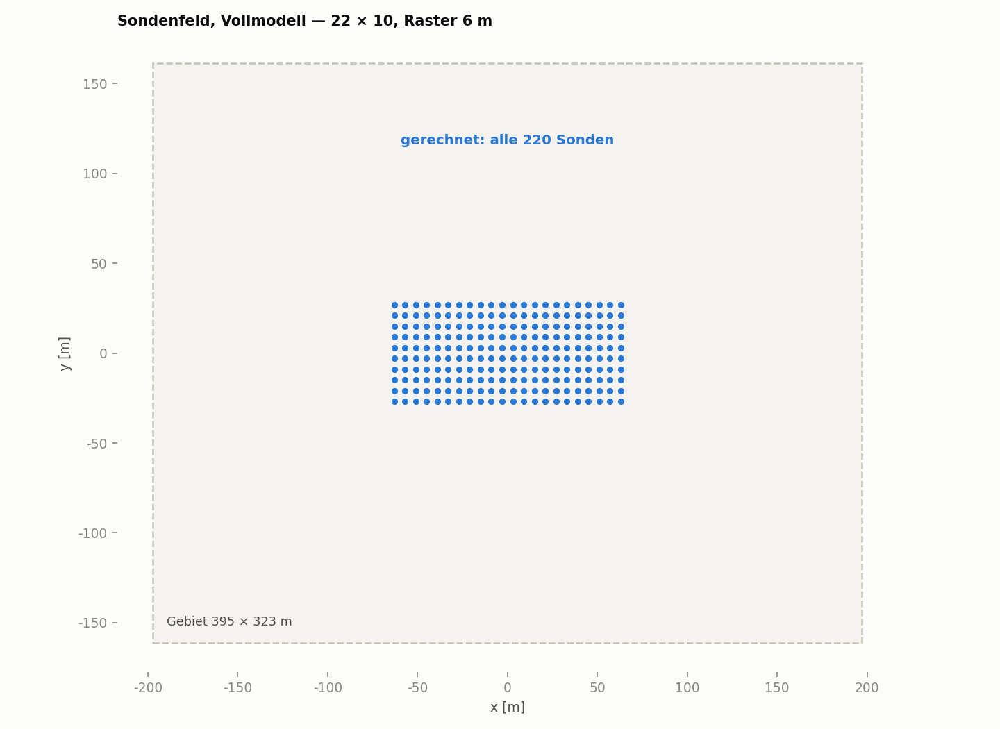
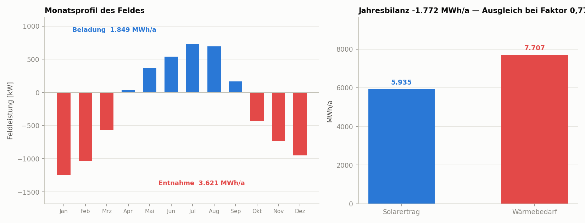
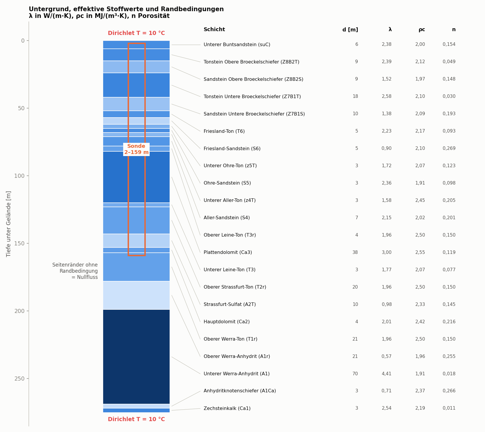
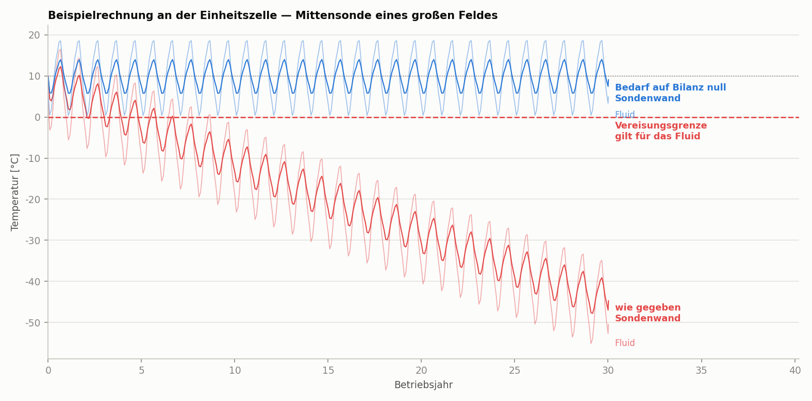
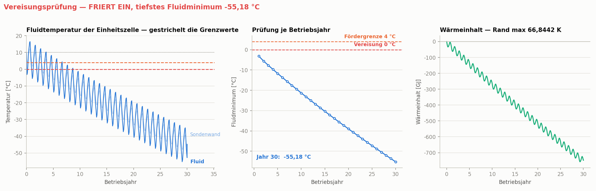

---
title: "BTES-Sondenfeld — parametrisierte Lösung"
subtitle: "Reine Wärmeleitung, wahlweise auf dem vollen Feld oder einem Viertel"
lang: de
---

# Worum es geht

Ein Erdsonden-Wärmespeicher (BTES) nimmt im Sommer solaren Überschuss auf und
gibt ihn im Winter wieder ab. Zu berechnen ist, wie sich der Untergrund unter
einem vorgegebenen Lastprofil über Jahrzehnte verhält — und ob das Feld die
geforderte Wärme überhaupt tragen kann.

Das Modell hier rechnet dieselbe Aufgabe wie `btes/ex2_3d/btes_3d.py`, aber mit
drei Vereinfachungen. Die ersten beiden sind **keine Näherungen**: sie folgen
aus der Aufgabenstellung selbst. Zusammen sinkt der Aufwand je Zeitschritt um
etwa den Faktor 130, und erst dadurch werden 30 Betriebsjahre in wenigen
Stunden statt in Wochen rechenbar.

| Datei | Inhalt |
|---|---|
| `btes_loesung.py` | alles: Modell, Netz, OGS-Lauf, Auswertung, Abbildungen |
| `nachhaltigkeit.py` | Reihe von Reduktionsgraden, ohne je Grad neu zu rechnen |
| `pruefung.py` | 27 Selbstprüfungen des Modells, läuft in Minuten |
| `LOESUNG.md` / `LOESUNG.pdf` | dieses Dokument |
| `figures/` | die Abbildungen |
| `out/` | Netz, Projektdatei und Ergebnisse des Laufs |

Gesteuert wird alles über `CONFIG` ganz oben in der Datei; es gibt keine
Kommandozeilenschalter:

```
python btes_loesung.py
```

Welche Schritte laufen, steht im ersten Block:

```python
"ablauf": {
    "bilanz":       True,   # Lastprofil, Energiebilanz, Modellgröße
    "netz":         True,   # Netz und Projektdatei erzeugen
    "ogs":          True,   # Simulation starten
    "auswertung":   True,   # Vereisungsprüfung aus der Ausgabe
    "abbildungen":  True,   # Geometrie, Untergrund, Lastprofil
    "beispiellauf": False,  # zwei Einheitszellenläufe für Abbildung 4
    "pdf":          False,  # dieses Dokument nach PDF
},
```

Für einen ersten Blick genügt `bilanz` allein — das dauert Sekunden und zeigt
Energiebilanz, spezifische Entzugsrate und Modellgröße, bevor irgendetwas
stundenlang rechnet.

---

# Die drei Vereinfachungen

## 1 — Temperatur statt Temperatur und Druck

Der HT-Prozess von OGS löst Temperatur **und** Druck. Im BTES-Aufbau ist das
Druckfeld aber identisch null, und zwar exakt:

* kein thermischer Auftrieb (Ausdehnungskoeffizient null),
* keine Schwerkraft (`specific_body_force = 0 0 0`),
* $p = 0$ als Dirichlet-Rand oben und unten, Anfangswert $p = 0$,
* an den Seitenflächen keine Randbedingung.

Damit ist die Druckgleichung homogen und von der Temperatur entkoppelt; ihre
einzige Lösung ist $p = 0$ überall und zu jeder Zeit. Aus $p = 0$ folgt eine
verschwindende Darcy-Geschwindigkeit, der Advektionsterm der Energiegleichung
entfällt, und übrig bleibt reine Wärmeleitung. Wer einen HT-Lauf mitprotokolliert,
sieht das direkt: das Konvergenzkriterium meldet für die Druckkomponente
$|dx| = 0$ und $|x| = 0$.

**Auch mit Grundwasserströmung bliebe die Wärmeleitung dominant.** Mit einem
hydraulischen Gradienten $i = 2 \cdot 10^{-3}$ und der durchlässigsten Schicht
dieses Stapels ($k \approx 5 \cdot 10^{-14}$ m²) ergibt sich

$$v = \frac{k}{\mu}\,\rho g i \approx 1 \cdot 10^{-9}\ \mathrm{m/s} \approx 3\ \mathrm{cm/a}$$

und daraus eine Péclet-Zahl über den Sondenabstand $L = 6$ m von

$$Pe = \frac{v\,\rho_f c_f L}{\lambda} \approx 0{,}03 .$$

Das liegt zwei Größenordnungen unter eins. Damit Advektion mitspielt, bräuchte
es etwa $k \approx 4 \cdot 10^{-12}$ m², also rund das Achtzigfache — einen Sand-
oder Kiesaquifer, nicht die dichte Abfolge dieses Modells. Als Faustregel wird
Grundwasserströmung für Erdwärmesonden ab etwa $10^{-8}$ m/s relevant.

Die Stoffwerte müssen dafür einmal vorab gemischt werden, weil
`HEAT_CONDUCTION` keine Phasen kennt:

$$\lambda_\mathrm{eff} = (1-n)\,\lambda_s + n\,\lambda_f, \qquad
(\rho c)_\mathrm{eff} = (1-n)\,\rho_s c_s + n\,\rho_f c_f$$

Genau diese beiden Mischungen bildet der HT-Prozess intern ebenfalls. In die
Gleichung geht nur das Produkt aus Dichte und Wärmekapazität ein; die
Aufteilung auf beide Größen ist frei und hier so gewählt, dass beide Zahlen
physikalisch lesbar bleiben (`effektive_stoffwerte`).

> **Nicht mehr anwendbar**, sobald eine Voraussetzung fällt: eine
> Druckrandbedingung an den Seitenflächen, ein wirklich durchlässiger Aquifer
> im Stapel, thermischer Auftrieb oder Schwerkraft. Dann gehört der HT-Prozess
> zurück ins Modell.

## 2 — Wahlweise ein Viertel statt des ganzen Feldes



Diese Vereinfachung ist die einzige der drei, die **abschaltbar** ist:
`field.symmetrie` steht voreingestellt auf `"voll"`, rechnet also alle 220
Sonden. `"viertel"` spart den Faktor vier an Knoten und rund den Faktor 13 an
Rechenzeit, ohne das Ergebnis zu verändern — warum, steht hier.

Das Sondenfeld ist ein regelmäßiges Rechteckraster, mittig im Gebiet. Alle
Sonden tragen dieselbe Lastkurve, die Schichten liegen waagerecht, die
Randbedingungen oben und unten sind gleichförmig. Damit sind die beiden
senkrechten Ebenen $x = 0$ und $y = 0$ Spiegelebenen des **gesamten** Problems —
Geometrie, Material, Last und Randbedingungen zugleich.

Auf einer Spiegelebene verschwindet der Wärmestrom senkrecht zur Ebene. Und in
OGS ist eine Fläche **ohne** Randbedingung genau das: ein Nullfluss-Rand. Die
Schnittflächen bekommen deshalb bewusst keine Randbedingung — damit ist die
Symmetriebedingung exakt erfüllt, ohne dass etwas hinzugefügt werden müsste.
Das Viertel liefert dieselbe Lösung wie das Vollfeld, nicht eine genäherte.

**Der interessante Teil bleibt im Modell.** Die stärkste Abkühlung tritt in der
Feldmitte auf, weil sich dort die Nachbarsonden am stärksten gegenseitig
beeinflussen; die Randsonden sind stets die unkritischen. Die Feldmitte liegt
aber genau auf dem Schnittpunkt beider Symmetrieebenen und gehört damit zum
Viertel. Weggelassen wird nur, was sich ohnehin spiegelbildlich wiederholt.

Voraussetzung ist eine **gerade Sondenzahl je Richtung**, damit keine Sonde auf
einer Schnittebene liegt. Bei ungerader Zahl säße eine Sonde halbiert auf der
Ebene und ihr Quellterm müsste mit halbiert werden; das Skript bricht in diesem
Fall mit Erklärung ab, statt still etwas Falsches zu rechnen.

> **Nicht anwendbar** bei unsymmetrischem Feldgrundriss, einzeln geregelten
> Sonden mit unterschiedlichen Lasten, oder regionaler Grundwasserströmung —
> letztere bricht die Symmetrie in Strömungsrichtung, üblich ist dann noch ein
> Halbmodell mit Schnitt quer zur Strömung.

## 3 — Prismen statt Tetraeder

Tetraeder sind isotrop: wer in der Ebene 0,4 m Elementgröße braucht, bekommt
0,4 m auch in der Tiefe — bei 157 m Sondenlänge also rund 260 Elementlagen. Das
Temperaturfeld um eine Sonde ist aber quasi eindimensional radial; axial
passiert außer an Kopf und Fuß fast nichts.

Deshalb wird hier ein 2D-Grundriss in $z$ extrudiert: fein in der Ebene, grob in
der Tiefe, mit konformen Schichtgrenzen. Jede geologische Schicht bekommt
mindestens eine Elementlage; bei diesem Stapel ergeben sich 59 statt 260.

Eine Netzstudie an der Einheitszelle über 30 Jahre bestätigt die These:

| Elementgröße an der Sondenwand | dz | Knoten | Fehler gegen den Grenzwert |
|---:|---:|---:|---:|
| 0,40 m | 4 m | 3.840 | +416 mK |
| 0,30 m | 4 m | 5.280 | +326 mK |
| **0,20 m** | **4 m** | **10.440** | **+163 mK** |
| 0,15 m | 4 m | 16.860 | +91 mK |
| 0,10 m | 4 m | 35.580 | +33 mK |
| 0,075 m | 4 m | 60.000 | +12 mK |
| 0,10 m | **2 m** | 63.451 | Verschiebung nur −50 mK |

**Empfindlich ist ausschließlich die Ebene.** Die Elementhöhe von 4 m auf 2 m zu
halbieren verschiebt das Ergebnis um 50 mK, die Ebene von 0,40 m auf 0,075 m um
416 mK.

Welche Auflösung ein Lauf bekommt, entscheidet nicht eine feste Zahl, sondern
das Knotenbudget `netz.ziel_knoten`: das Skript vernetzt die Ebene, zählt die
Knoten und vergröbert so lange, bis das Budget eingehalten ist — und meldet,
wenn es das getan hat. Für das volle Feld mit 220 Sonden bedeutet das:

| `ziel_knoten` | Knoten | Wand | Fehler | 1 Jahr | 30 Jahre |
|---:|---:|---:|---:|---:|---:|
| 1,5 Mio. | 1,50 Mio. | 0,478 m | > 416 mK | 8 min | 4,1 h |
| **2,5 Mio.** | **2,51 Mio.** | **0,358 m** | **378 mK** | **22 min** | **10,5 h** |
| 4,0 Mio. | 4,00 Mio. | 0,279 m | 292 mK | 51 min | 25,1 h |
| 9,0 Mio. | 7,35 Mio. | 0,200 m | 163 mK | 2,6 h | 77,8 h |

Die Fehlerspalte gilt für den Lastfall wie gegeben mit rund 66 K Auslenkung;
bei ausgeglichener Bilanz (rund 10 K) ist sie etwa ein Sechstel davon. Die
Voreinstellung steht auf 2,5 Mio. — fein genug, dass der Netzfehler klein gegen
jede Entscheidung bleibt, die man aus dem Ergebnis ableitet, und grob genug für
einen Lauf über Nacht. Wer die letzten Zehntelkelvin braucht, stellt hoch.

Wichtig ist dabei die Zeile

```python
gmsh.option.setNumber("Mesh.MeshSizeFromPoints", 0)
```

Ohne sie schlägt die an den Boxecken gesetzte Größe weit ins Feld durch und der
Parameter `groesse_im_feld_m` ist wirkungslos.

**Alle Netze liegen auf der optimistischen Seite.** Ein grobes Netz verschmiert
die Volumenquelle über effektiv mehr Volumen und macht die Sondentemperatur
weniger extrem — in der Förderphase also zu warm. Die echte Temperatur liegt
unter jeder Rechnung.

---

# Wie die Last anzugeben ist

Das ist die häufigste Fehlerquelle beim Viertelmodell. Angegeben wird die
**Gesamtlast des Feldes**, nie die Last je Sonde. Das Skript teilt intern durch
die Sondenzahl des **vollen** Feldes:

$$P_\mathrm{Sonde} = \frac{P_\mathrm{Feld}}{n_x \cdot n_y}$$

und prägt diesen Wert jeder im Viertel modellierten Sonde auf. Wer selbst durch
die Sondenzahl des Viertels teilt, rechnet mit der vierfachen Last.

Der Quellterm wirkt volumetrisch auf der Sondenbox:

$$q_v = \frac{P_\mathrm{Sonde}}{d_x \cdot d_y \cdot L_\mathrm{Sonde}}$$

Zur Kontrolle druckt jeder Lauf die Aufteilung und die spezifische Entzugsrate
in W/m; der Literaturbereich für Erdwärmesonden liegt bei 20 bis 70 W/m.

## Zwei Wege, das Profil zu setzen

**`modus = "solar_bedarf"`** — das Feld sieht die Speicherbilanz aus
Kollektorertrag und Wärmebedarf:

$$\Delta Q(m) = A_\mathrm{Koll} \cdot q_\mathrm{sol}(m) - f \cdot Q_\mathrm{Bedarf}(m)$$

Überschuss lädt, Defizit entlädt. Einstellbar sind Kollektorfläche,
spezifischer Monatsertrag, Jahresbedarf, Bedarfsprofil und ein Bedarfsfaktor
$f$, der **nur** die Bedarfsseite skaliert.

**`modus = "direkt"`** — zwölf Monatswerte in kW werden unverändert benutzt.



---

# Der Untergrund

Frei konfigurierbare Schichtliste von oben nach unten; die Mächtigkeiten
addieren sich zur Gesamttiefe. Für einen homogenen Untergrund genügt ein
einziger Eintrag. Die Sonde darf beliebig viele Schichten durchstoßen.



Die Gebietsgröße ist kein Schönheitsparameter. Über lange Zeiträume muss das
Gebiet mindestens die thermische Eindringtiefe

$$\delta \approx \sqrt{4 \alpha t}$$

jenseits der äußersten Sonde reichen — bei $\alpha \approx 1 \cdot 10^{-6}$ m²/s
sind das nach 30 Jahren rund 60 m. Ist das Gebiet zu klein, sperren die
adiabaten Seitenwände die Auskühlung ein und das Ergebnis fällt zu pessimistisch
aus.

---

# Beispielrechnung



Beide Kurven stammen aus der **Einheitszelle** — einer einzelnen Sonde in ihrem
Raster mit adiabaten Seitenrändern. Das ist dieselbe Symmetrieüberlegung wie
beim Viertelmodell, nur zu Ende geführt: für ein großes Feld ist es die exakte
Lösung für die Mittensonde, und es kostet knapp eine Minute statt mehrerer
Stunden.

**Rot, wie gegeben.** Der Entnahme von 3.621 MWh/a steht eine Beladung von nur
1.849 MWh/a gegenüber — es wird fast doppelt so viel entnommen wie eingespeist.
Der Untergrund kühlt Jahr für Jahr weiter aus, im dreißigsten Jahr auf unter
−45 °C. Kein Feld dieser Größe trägt das, und keine Sondenzahl repariert es:
ein Saisonalspeicher verschiebt Wärme **innerhalb** eines Jahres, ein
dauerhaftes Defizit kann er nicht liefern.

**Blau, Bedarf auf Bilanz null.** Bei einem Bedarfsfaktor von 0,7701 gleichen
sich Beladung und Entnahme aus. Die Kurve pendelt stabil um den
Ausgangszustand, der Mehrjahresdrift verschwindet vollständig. Übrig bleibt nur
der Saisonhub.

Das Skript rechnet den Faktor für die ausgeglichene Bilanz selbst aus und meldet
ihn bei jedem Lauf, auch wenn nur `ablauf.bilanz` eingeschaltet ist.

---

# Prüfung gegen den Gefrierpunkt



**Maßgeblich ist die Fluidtemperatur, nicht die Sondenwand.** Die 0,6-m-Box des
Modells ist kein Bohrloch: sie unterschätzt den Temperaturabfall zur Wand hin,
und der Bohrlochwiderstand zwischen Wand und Fluid fehlt ganz. Beides wird über
die Linienquellenlösung nachgetragen (`fluid_korrektur`):

$$T_\mathrm{Fluid} = T_\mathrm{Box} + q' \left[\frac{\ln(r_\mathrm{box}/r_b)}{2\pi\lambda} + R_b\right]$$

Bei diesem Feld sind das rund **5 K Unterschied** in der Förderphase. Eine
Sondenwand bei 6 °C sieht komfortabel aus, während das Fluid schon nahe null
steht — wer nur die Wandtemperatur prüft, kommt zu einem falschen Ergebnis.

Das linke Bild ist die eigentliche Prüfung: das Fluidminimum jedes Betriebsjahres
gegen die Vereisungsgrenze von 0 °C und die Fördergrenze von 4 °C, die das
Übungsskript ansetzt.

Das rechte Bild ist die Auslegung, und sie kostet **keine weitere Rechnung**.
Weil reine Wärmeleitung linear in der Last ist, folgt aus einem einzigen
Zellenlauf die nötige Sondenzahl für jede Grenze in geschlossener Form
(`sondenzahl_fuer_grenze`):

| Lastfall | für 0 °C | für 4 °C |
|---|---:|---:|
| wie gegeben | 1.434 | 2.389 |
| Bedarf auf Bilanz null | 220 | 351 |

**Die Zahl links ist selbst das Ergebnis.** 1.434 Sonden bei 6 m Raster
bedeuten rund 5 ha Grundfläche und eine spezifische Entzugsrate von etwa
5 W/m — ein Viertel der untersten Faustformel von 20 W/m. Ein Feld, das so
betrieben werden müsste, ist kein sinnvolles Feld mehr. Die Rechnung zeigt
damit nicht, wie groß man bauen müsste, sondern **dass die Sondenzahl die
falsche Stellschraube ist**: sobald die Bilanz ausgeglichen ist, genügen die
vorhandenen 220 Sonden.

> Die Sondenzahl aus dieser Skalierung ist eine **Untergrenze**. Sie behandelt
> die Mittensonde eines unendlich großen Feldes; ein reales endliches Feld
> verliert bei ausgeglichener Bilanz über den Umfang Wärme und wird dadurch
> eher kälter, nicht wärmer. Für eine belastbare Auslegung gehört am Ende ein
> Lauf des vollen Viertelfeldes dazu.

---

# Rechenzeiten

| Modell | Freiheitsgrade | simuliert | Rechenzeit |
|---|---:|---:|---:|
| Einheitszelle, grobes Netz | 5.280 | 30 Jahre | ≈ 50 s |
| Einheitszelle, feines Netz | 60.000 | 30 Jahre | ≈ 13 min |
| Viertelfeld 220 Sonden | 1,6 Mio. | 1 Jahr | ≈ 10 min |
| Viertelfeld 220 Sonden | 1,6 Mio. | 30 Jahre | ≈ 5–6 h |
| Vollfeld 220 Sonden, Budget 2,5 Mio. | 2,5 Mio. | 30 Jahre | ≈ 10 h |
| Vollfeld 220 Sonden, Budget 9 Mio. | 7,3 Mio. | 30 Jahre | ≈ 78 h |
| *zum Vergleich:* HT-Vollmodell | 2,8 Mio. | 1 Jahr | ≈ 24 h |

Die Rechenzeit wächst mit etwa $n^{1{,}86}$ — gemessen zwischen dem Viertel- und
dem Vollfeldlauf. Das Netz doppelt so fein zu machen kostet in der Ebene den
Faktor vier an Knoten und damit rund den Faktor **13** an Zeit. Deshalb lohnt
jede Vorüberlegung an der Einheitszelle.

Für Parameterstudien immer zuerst die Einheitszelle
(`field.einheitszelle = True`). Weil reine Wärmeleitung linear in der Last ist —
in einer Gegenprobe auf 0,0000 % genau bestätigt — skaliert die
Temperaturauslenkung exakt mit der Last je Sonde:

$$T(N) - T_0 = \bigl(T(N_\mathrm{ref}) - T_0\bigr)\,\frac{N_\mathrm{ref}}{N}$$

Aus **einem** Zellenlauf folgt damit die nötige Sondenzahl für jede
Temperaturgrenze in geschlossener Form, ohne eine einzige weitere Rechnung.

Der Löser ist auf CG mit Diagonalvorkonditionierer gestellt. Bei reiner
Wärmeleitung ist die Systemmatrix symmetrisch positiv definit; ILUT wäre hier
unnötig teuer und verbrauchte im HT-Vollmodell rund 97 % der Rechenzeit.

---

# Fallstricke

**Umlaute in Pfaden.** OGS kann Projektdateien aus Pfaden mit Nicht-ASCII-Zeichen
auf Windows nicht öffnen — der Lauf bricht mit „File does not exist" ab, obwohl
die Datei vorhanden ist. Deshalb heißt dieser Ordner `Loesung` und nicht
`Lösung`. Für Ordner- und Dateinamen im Projektpfad bei ASCII bleiben.

**Sondenmaterial.** Die Sondenboxen bekommen das Material der mittleren Schicht
— die didaktische Voreinstellung des Übungsskripts, kein Verfüllmaterial. Für
eine realistische Rechnung gehört dort ein Bohrlochverfüllmaterial hinein.

**Fluidtemperatur.** Sie ist keine Rechengröße des Modells, sondern eine
Projektion der Boxtemperatur auf den Bohrlochradius mit einem angenommenen
Bohrlochwiderstand $R_b$. Beide Werte stehen in `CONFIG["borehole"]` und gehen
linear ein.

**Kein geothermischer Gradient** in der Voreinstellung. Für einen realistischen
Untergrund `initial.geothermischer_gradient_K_m` auf etwa 0,03 setzen.
